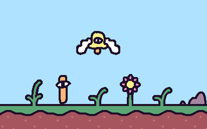

# State of KAPLAY #&#8203;5

> lajbel, FRIDAY 13th (☠️) of June, 2025, from KAPLAY HQ

Hey! Now, it's the time to talk about **KAPLAY**, the things we did, the things we're going to do and all stuff related to the **KAWorld** (or even, KA-_Universe_). Again, I've sub estimated how much stuff I have to document on this process, so this blog is charged _**with a lot of content**_, please, enjoy your reading.

## ✨ Balance of World...

> Team Update

Our Team is composed of _wonderful persons_, you probably knew two:

- **MF** represents the **Wisdom** for take the right decision inside the repository.
- **lajbel** represents the **Power** of ~~breaking~~ production and create new awesome products.

But something was missing, the **Courage** of create something new, wonderful, something _different_...

_wait for it_

**Misanthrope!** Also known as **Imaginarny**, but now also known as **THE HERO**, has joined to the **KAPLAY Team**, as the 3rd member of the team, he's here as the **Courage**!

_Now, the KAPLAY Triforce is complete!_

As one of the KAPLAY founders, I'm so happy having him working along with us, is not only a new team member, for me, he's also a friend. Now, he is our **official** designer, so all the eggcellents UI/UX you're going to see, comes from his hand.

## 🧰 Where my last project was...?

> Product Update

And right after that **EPIC** introduction, will get into a ✨ P R O D U C T U P D A T E ✨ (_I don't know how to write these blogs, help me_).

**KAPLAYGROUND** has evolved not only as a Playground, but also as a full-featured Editor. Now, we're introducing the **2.2** and **2.3**!

In **2.2**, we give you the **New Project Browser**. You can do _everything_ with it: **Filter** your projects, get into different **difficulties**, see your saved projects and all with a nicer UX/UI binged by our **Courage**.

Now, in **2.3** you're receiving a lot of _Quality of Life_ updates and new code integrations, like auto-complete for components inside add() statements.

Next, in **2.4**, we will be adding:

- _Version Filter_: Filter demos and projects using specific KAPLAY versions.
- _ESBuild_: Playground works just as your local project does, so features like import/export and bundle code optimization will be possible now!

## 🖥️ 20 changelogs

> Product Update

Okay okay this thing of KAPLAYGROUND is so good but, what's going on with KAPLAY? There's a lot of stuff to say about it's development, so will take on with the ✨ _H I G H L I G T H E D_ ✨ features that are coming now to **v4000** alphas:

- **Systems API**: Replace system-core KAPLAY features (like Physics) and put their own.
- **Global Layering:** Layers now work globally - [#736](https://github.com/kaplayjs/kaplay/pull/736) - Example
- **Picture API:** Optimize many draw calls in one with `drawPicture()` - [#650](https://github.com/kaplayjs/kaplay/pull/650) - [Example](https://play.kaplayjs.com/?example=picture&version=4000.0.0-alpha.19)
- **Parent options:** Choose want to keep and want to drop when changing an object's parent, in the `obj.setParent` API - [#562](https://github.com/kaplayjs/kaplay/pull/562)
- **A lot of text-related improvements**: [#676](https://github.com/kaplayjs/kaplay/pull/676), [#687](https://github.com/kaplayjs/kaplay/pull/687), [#691](https://github.com/kaplayjs/kaplay/pull/691). (Special thanks to dragoncoder047)
- **Improvements in rendering**: [#760](https://github.com/kaplayjs/kaplay/pull/760)

In general terms, those were the most important changes. But there were **a lot** of bug fixes, you can see them all [here](https://github.com/kaplayjs/kaplay/pulls?q=is%3Apr+created%3A%3E2025-02-28+is%3Aclosed).

**KAPLAY v4000** is closer than never, maybe we can even get a beta soon, but now the hardest part left, _change-logging and documenting_ (😥).

## ⛏️ In the cubes KAWorld...

> Minecraft Server

Okay, maybe your brain is already tired of reading this (and _of_ **me** ~~_**overusing**_~~ **text_styles**). Will talk about something fun. In the KAPLAY Minecraft Server:

Thanks to Misa, we reopened our Minecraft Server, so yeah, you can join and play again! Maybe you even found me or Misa playing.

But nothing... _**nothing**_ can be perfect, right? There's a problematic we should talk about... **Genocide of the iron Golems**, done by a person who I considered a _friend_... If you care about Iron Golems life, I recommend you checking [savethegolems.org](https://savethegolems.org).

## 🏳️‍🌈 Pride Month

> Community

It's pride month, June! And KAPLAY show it's support to all our Queer community, we're going to highlight a special game made by one of our greatest queer community members and someone I consider a _friend_. Oh! Also we got this so cool photo for pride month:

> Would you like us keeping this photo?

## 🌱 Community Creations

> Community

Now it's time to see a lot of cool stuff our community made these days.

### 🏌 Golf Course: Ocean Wave Edition

**Erik** have finished this great mini-golf game. It's game feeling, mechanics, visuals, music. All it's just perfect in this game, so give it a [try on Itch.io](https://erikgxdev.itch.io/golf-course)!

### 👾 KAPLAYWare, our special highlighted game

From **AmySparkNG**, Clickery Hexagon creator (and if you haven't played it, check our section about it in [State of KAPLAY #2](https://kaplayjs.com/blog/sok2/)) is developing a new game called **KAPLAYWare** (**kaplayware** or **KAPLAYWARE** is also acceptable).

It's like Wario-Ware, but with KAPLAY. It also has it's own "_engine_" built on top of KAPLAY.

I sincerely think it's going the next **BIG** KAPLAY game, so check out [her blog about it](https://amyspark-ng.newgrounds.com/news/post/1524357).

### ⚔️ Tutorial: RPG Game using JavaScript

**EARTHBOUND**, **Final Fantasy**, **Deltarune** (me) fans! I think more people should watch this **AMAZING** and _now free_ tutorial making a fully RPG game system using KAPLAY, just watch it. From the hand of **JSLegend** (and he's really a legend):

<iframe width="560" height="315" src="https://www.youtube.com/embed/sX-sR0G8Alc?si=uSb7HtVVtJAr_eXz" title="YouTube video player" frameborder="0" allow="accelerometer; autoplay; clipboard-write; encrypted-media; gyroscope; picture-in-picture; web-share" referrerpolicy="strict-origin-when-cross-origin" allowfullscreen></iframe>

### 🎨 KAPLAY-Like assets

Fowl has surprised us with his 29 new **KAPLAY-like** styled assets, they look so pretty!

You can download them for free in [Itch.io](https://fowluhhdev.itch.io/kcepi).

### 📦 More stuff

- 🤖 **nojaf** is exploring [**REScript** along KAPLAY](https://nojaf.com/rescript-kaplay/)
- 🇫🇷 **Colin** [French docs](https://martiansparlor.com/ateliers/kaplay/documentation) features a lot of **AWESOME** examples using KAPLAY

## 👁️ KAPLAY Crew Revamped

> Product Update

Let's go with Product Updates again with something we're doing **NOW**. And it is **KAPLAY Crew v2.0**, the next Crew Version:

Don't want to do a lot of spoiler, just expect **more assets**, **more lore**, **more wiki** and a lot of more **FUN** using our next asset browser. We're maybe showing more in our social media so be sure to [follow us](https://linktr.ee/kaplayjs).

## 🐱 Random Cat GIF

> Do you really think it's okay having this here? OK...

## 🦖 KAPLAY ANNIVERSARY WHAT WHAT WHAT

> Something Special...

Yeah, it's already been **a year** with this project. I wanted to do something special, like a video but we didn’t really have the time with everything we’re preparing for the upcoming months. Instead, there's a little gift for all you...

## 🦊 HAPPY FONT!

> Product Update

Hey! The classic KAPLAY defaulty font **happy** got a redesign with a bunch of changes on it's **2.0** version. The main change is that now it's available in `.ttf` format, so you can use it in your notepad, your code-editor, terminal, or even in your calculator (doubt it).

It is **AVAILABLE NOW** on Itch.io:

<iframe frameborder="0" src="https://itch.io/embed/3570131?bg_color=f2ae99&amp;fg_color=390947&amp;link_color=4e187c&amp;border_color=7640a4" width="552" height="167"><a href="https://kaplay.itch.io/happy">Happy Font! by KAPLAY</a></iframe>

With that, I want to say thank you to all who uses KAPLAY, enjoy and love it. I love the community we got and all the people around it. Thank you <3

## ♥️ KAPLAY Supporter

> Funding

As you know, KAPLAY is free and open-source. As a way for you to support us, we have launched **KAPLAY Supporter** donation, with $5/mo, you get a lot of benefits:

- ♥️ **Supporter Discord Role**
- 🧙 **Commission a Character**
- 🗳️ **Supporter-exclusive Polls**
- 👀 **Sneak Peeks of Upcoming Features**
- ♥️ **Private Discord channel with KAPLAY Devs**

So, if you want and if you can afford it, would be a big help for us. Anyway, as I always say, making games with KAPLAY and spreading the word about it is already a lot of help <3.

You can check all details about supporting in [OpenCollective](https://opencollective.com/kaplay/contribute/bean-rex-77456).

> Much of these things you're seeing in SOK #5 were shared on our supporters channels

## 🦖 The State of KAPLAY

> The State of The State of KAPLAY

So, this is the state of KAPLAY:

| State Of         | Stable    | **Dev**  | What's coming these weeks             |
| ---------------- | --------- | -------- | ------------------------------------- |
| **KAPLAY**       | 3001.0.18 | 4000.0.0 | Hover rework, API style normalization |
| **KAPLAYGROUND** | 2.3.2     | 2.4.0    | ESbuild & Filter per version          |
| **KAPLAY Site**  | 1.1.3     | 1.2.0    | New Crew browser                      |
| **KAPLAY Crew**  | 1.7.0     | 2.0.0    | Package and plugin improvements       |
| **Happy Font**   | 2.0       | N.A      | N.A                                   |

## 📫 The State of The State of KAPLAY

> The State of The State of The State of KAPLAY

So okay, we're reaching the end to the **MAGNIFIC** State of KAPLAY, the fifth edition. But now, what to expect on the next weeks? I'm not doing a State of KAPLAY every month (I never did, but now I'm realistic).

From now on State of KAPLAY will be held when we get **important updates**. I want to make state really **interesting** for reading and having fun as everything we do inside KAPLAY.

> However, I would say next one will be not with that big lap like we got in between #4 and #5. Don't expect it being this big anyway xD

By the way, I opened the [`📫-sok-dump`](https://discord.gg/nrApn8rZ6h) channel in our **✨ A W E S O M E ✨** Discord Server, so you can send there what you would like to be in the next **State of KAPLAY** (SOK 🧦) edition :D

Saying that, I go to go. Bye, thanks for reading and have a nice day.
