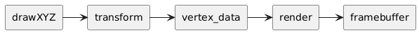
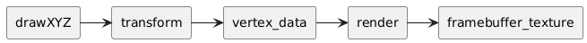

# Canvas

A Kaplay canvas is basically a framebuffer texture. It is used for optimization
in some cases, though sometimes a picture may be better, since a picture uses
less memory and is resolution independent. The most important reason to use a
canvas is to create procedural sprites or render a multi-stage shader. This is
the normal pipeline, where everything is rendered to the screen framebuffer.



When a canvas is active, everything is drawn to the canvas framebuffer texture
instead.



# Creating a canvas

A canvas is created by calling `makeCanvas` and passing its `width` and
`height`.

```ts
const canvas = makeCanvas(320, 200);
```

There are multiple ways to put content in a canvas.

# Drawing in a canvas

We can draw directly into a canvas by calling `draw()` and passing a function or
lambda with our draw routine.

```ts
canvas.draw(() => {
    drawSprite({
        sprite: "bean",
    });
});
```

This is actually a helper function which binds and unbinds the canvas for you.
If your code is more complex than a simple draw routine, it may be more
practical to use these directly.

```ts
canvas.bind();
drawSprite({
    sprite: "bean",
});
canvas.unbind();
```

There is also a component, which makes sure this object and all its children are
drawn into the canvas instead of the screen.

```ts
add([sprite("bean"), drawon(canvas)]);
```

# Drawing a canvas

You can draw a canvas by using drawCanvas, or by drawing an uvquad.

```ts
drawCanvas({
    canvas: canvas,
});

drawUVQuad({
    width: canvas.width,
    height: canvas.height,
    tex: canvas.tex,
});
```

You can also add an object with an uvquad component. Though since you can't pass
a texture easily, this won't work for now.

```ts
add([
    // TODO: Where to pass the texture?
    uvquad(canvas.width, canvas.height),
]);
```

# Saving a canvas

A canvas can be saved to an image or a dataURL. This dataURL can be passed to
loadSprite in order to load the image created on the canvas into the
spritesheet.

```ts
const img: ImageData = canvas.toImageData();
const dataURL: string = canvas.toDataURL();

loadSprite("proceduralSprite", dataURL);
```

# Disposing of a canvas

When done, a canvas needs to be freed in order to free the WebGL buffer.

```ts
picture.free();
```
