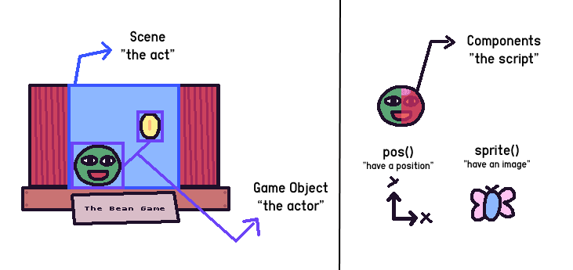

import Code from "@/components/Content/CodeWithKAPLAYGROUND.astro";

# Basic Concepts

To get started with KAPLAY, you must know 4 main concepts: **Scenes**, **Game
Objects**, **Components**, and **Events**.

You can think of your game as a **_theater_**: **scenes** are the acts, **game objects** are
the actors, and **components** are the scripts the actors follow:

## Game Initialization

All KAPLAY games start with the `kaplay(opt?)` function. This function makes
available all methods and functions that you will use to create your game. Optionally it takes
a `KAPLAYOpt` options object.

<Code code={`// Start with default options
kaplay();

// Start with options
kaplay({
    width: 200,
    height: 200,
    background: "#d46eb3",
    scale: 2,
    canvas: document.getElementById("canvas"),
});`}

pgCode={`// Start with default options
// kaplay();

// Start with options
kaplay({
    width: 200,
    height: 200,
    background: "#d46eb3",
    scale: 2,
});`}
/>

## Game Objects

The **game object** is the basic unit of KAPLAY. The player, an enemy or a bean are all game objects, they are our actors. They
move, interact, and make the game interesting.

You can create objects with the `add()` function, which takes an array of
**components** and **tags**. The **components** define the object's behavior while **tags** classify it in some way:

<Code code={
`const obj = add([
    rect(32, 32), // Draw this object as a rectangle
    pos(10, 20), // Position this object in X: 10 and Y: 20
    "shape", // Classify this object as "shape"
]);`}

pgCode={`kaplay();

const obj = add([
    rect(32, 32), // Draw this object as a rectangle
    pos(10, 20), // Position this object in X: 10 and Y: 20
    "shape", // Classify this object as "shape"
]);`}
/>

It returns a `GameObjRaw`, with which you can perform **game object operations**:

<Code code={`onKeyDown("right", () => {
    obj.move(200, 0); // Move the object while "right" key is held down [!code highlight]
});

const isShape = obj.is("shape"); // Check for tags [!code highlight]
debug.log(isShape); // Log it on the screen`}

pgCode={`kaplay();

const obj = add([
    rect(32, 32), // Draw this object as a rectangle
    pos(10, 20), // Position this object in X: 10 and Y: 20
    "shape", // Classify this object as "shape"
]);

onKeyDown("right", () => {
    obj.move(200, 0); // Move the object while "right" key is held down [!code highlight]
});

const isShape = obj.is("shape"); // Check for tags [!code highlight]
debug.log(isShape); // Log it on the screen
`}
/>

We go in depth with game objects in the [**Game Objects**](/docs/guides/game_objects)
guide.

## Components

Components are the building blocks of game objects. They define the behavior of
the object, like how it moves, looks, and interacts with other objects.

In KAPLAY, there are many built-in components that you can use to create your
game objects. For example:

- `pos(x, y)` sets the position of the object.
- `rect(width, height)` draws a rectangle.
- `color(r, g, b)` sets the color of the object.

We go in depth with components in the [**Components**](/docs/guides/components)
guide.

## Scenes

Scenes are what wrap the game objects -- the acts of the stageplay. Typical
scenes might include a main menu, the game itself, and a game over screen.

In KAPLAY, you create scenes with `scene()` and change them with `go()`:

<Code code={
`
kaplay();
loadBean(); // Load the default sprite.

scene("red_bean", () => {
    add([
        sprite("bean"),
        color(RED),
    ]);

    onKeyPress(() => {
        go("blue_bean");
    });
});

scene("blue_bean", () => {
    add([
        sprite("bean"),
        color(BLUE),
    ]);
});

// Initial scene
go("red_bean");
`
}

pgCode={`
kaplay();
loadBean();

scene("red_bean", () => {
    add([
        sprite("bean"),
        color(RED),
    ]);

    onKeyPress(() => {
        go("blue_bean");
    });
});

scene("blue_bean", () => {
    add([
        sprite("bean"),
        color(BLUE),
    ]);
});

// Initial scene
go("red_bean");
`}
/>

We go in depth with scenes on the [**Scenes**](/docs/guides/scenes) guide.

## Events

Events are specific moments of your game execution that you can handle and
execute code when that happens.

<Code code={
`
// Runs every frame (normally 60 times per second)
onUpdate(() => {
    if (isKeyDown("h")) {
        debug.log("hi");
    }
});

// Runs when the space key is pressed
onKeyPress("space", () => {
    debug.log("spaced");
});

// Runs when an object with the tag "shape" is added
onAdd("shape", () => {
    debug.log("shaped");
});
`
}

pgCode={`
kaplay();

// Runs every frame (normally 60 times per second)
onUpdate(() => {
    if (isKeyDown("h")) {
        debug.log("hi");
    }
});

// Runs when the space key is pressed
onKeyPress("space", () => {
    debug.log("spaced");
});

// Runs when an object with the tag "shape" is added
onAdd("shape", () => {
    debug.log("shaped");
});

add([
    rect(40, 40),
    "shape"
]);
`}
/>

We go in depth with events on the [**Events**](/docs/guides/events) guide.
