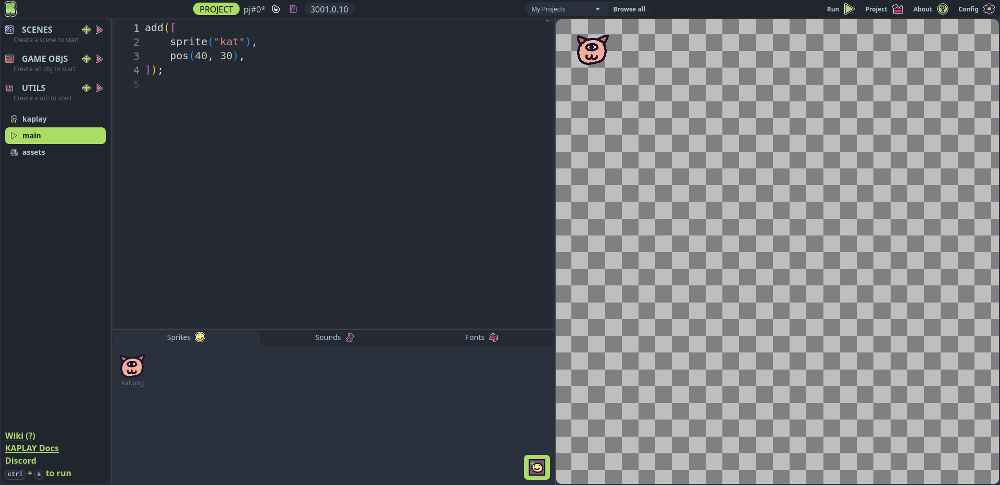
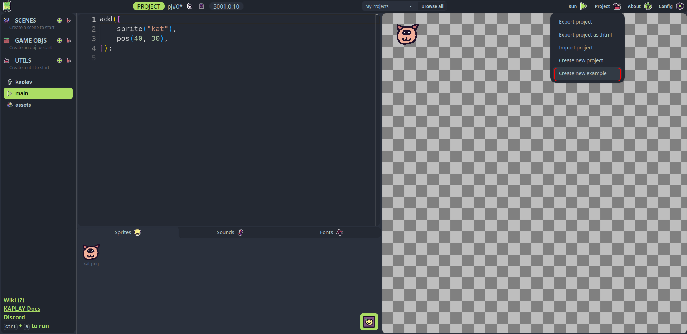
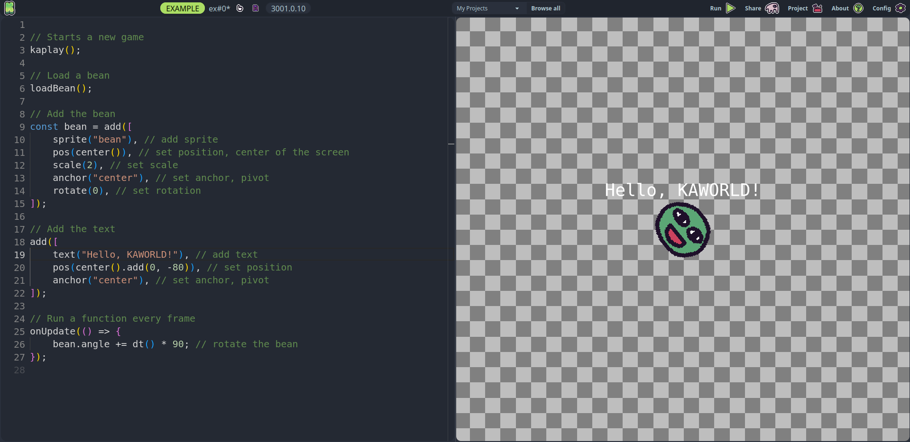

# Creating your first game

This is an intro tutorial that will cover the basic concepts and make a very
simple [Chrome Dino](https://en.wikipedia.org/wiki/Dinosaur_Game) - ish game.

# Prerequisites

Start creating games in KAPLAY it's easy. For fast forwarding, we will use the
[KAPLAYGROUND](https://play.kaplayjs.com)

If it's your first time opening the playground, you will see something like
this:

KAPLAYGROUND offers 2 types of projects:

- **Example**: Examples contains 1 file, you can load assets using URL and it's
  fast and sharable.
- **Project**: Projects have with asset uploading, multi-file editing, designed
  for more advanced stuff.

For this course we will use only 1 file. So we can safely use an **Example**
project. You have to go **Project -> Create new example**

You should have this view:

Now you can delete the code for starting clean.
