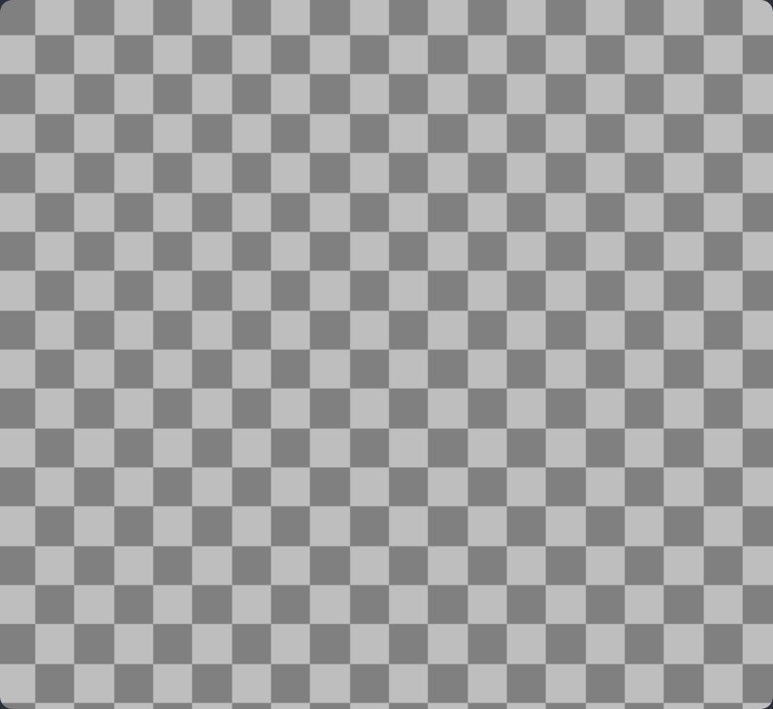

import Info from "@/components/Content/Info.astro";

# Adding your first object

Let's start by initializing the game application with the `kaplay()` function.
This will create a blank game:

```js
kaplay(); // Avaible globally when KAPLAY is installed
```



<Info crew="mark" title="The Context">OHHI, I'm Mark, the cheese. I'm here for
helping you. The KAPLAY Context it's all what the `kaplay()` function exports,
like the functions you will use across the game code</Info>

The context it's exported globally and also you can capturate the context in a
variable. Additionally, you can pass an some [options](/doc/KAPLAYOpt) object to
the `kaplay()` functions for initialize your game

As we are going to make this pixel art game, we will activate some options:

```js
kaplay({
    crisp: true, // disable anti-alias
});
```

With this, we're ready for our first challenge, creating a game object!
