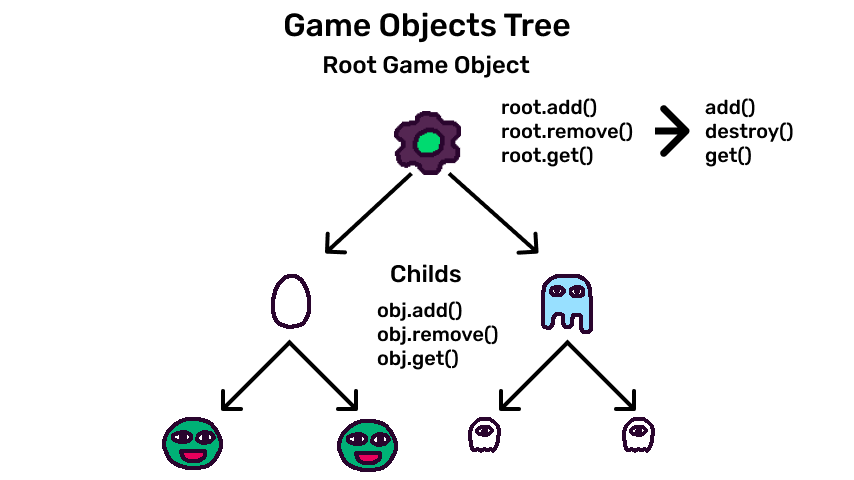

# Game Objects

Game objects are the entity unit of KAPLAY. They are the actors of your game,
the entities that move, interact, and make the game interesting.

## Creating Game Objects

We create game objects with the `add()` function. It creates the object and
attach it to the scene. It receives **components** and **tags**.

```js
const dinosaur = add([
    // while components gives different behaviours to the game obj
    rect(32, 32), // draw a rect
    pos(80, 80), // set a position
    // tags classify the game object
    "dangerous",
    "big",
]);
```

We will see in deep components and tags in their respective guides.

## Parents, childs and root

A game object can have child game objects. This will give to the children the
possibility of follow parent's position, rotation and scale.

```js
const player = add([
    rect(32, 32),
    pos(80, 80),
]);

const head = player.add([
    circle(16),
    pos(0, -16), // relative to player position
]);
```

**Every game object** is a child of the **root game object**. The root game
object is the game object that contains all the game objects in the scene.



That's why the `add()` function is, in fact, a `GameObjRaw.add()` method.

## Game Objects operations

### How to create a game object

```js
const bag = add([
    sprite("bag"),
]);
```

### How to remove a game object

```js
// you can use .destroy() method or the destroy() function
bag.destroy();
destroy(bag);
```

### How to get all game objects

```js
// get a list with all game objects
get("*");
// get a list of friends objects
get("friends");
```

### How to add a child

```js
// It adds a mini-bag to bag
const miniBag = bag.add([
    sprite("minibag"),
]);

const superMiniBag = bag.add([
    sprite("superminibag"),
    "favorite", // is the favorite
]);
```

### How to remove a child

```js
// We pass the game object reference
bag.remove(miniBag); // 18, independency
```

### How to get childs

```js
bag.get("*"); // all children
bag.get("favorite"); // [superMiniBag] - all children with tag favorite
```

You can see the full list of operations in the [`GameObjRaw`](/doc/GameObjRaw)
documentation.

## Creating game object dynamically

One way for create a game object is create a function that returns that game
object:

```js
function addBullet() {
    return addBullet([
        rect(6, 18),
        pos(80, 80),
        color(0.5, 0.5, 1),
    ]);
}

onKeyPress("space", () => {
    addBullet();
});
```
