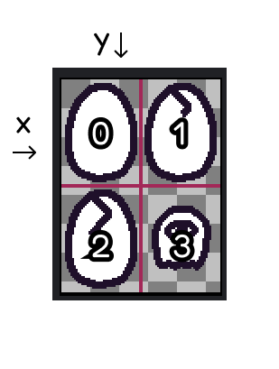

# Rendering sprites

The sprites are probably most of your visual aspects of your game.

## Loading Sprites

For load a sprite, you can use the `loadSprite()` function. This function mainly
takes two parameters, the sprite name and the sprite path.

```js
loadSprite("bean", "sprites/bean.png");
```

This will load the sprite `bean` from the `sprites/bean.png` file.

### Spritesheets

When you have a spritesheet, you probably have animations. For these cases, the
best option for you is to use the `loadSprite()`'s third argument, where you can
set options related to animations.



```js
loadSprite("player", "sprites/player.png", {
    sliceX: 2, // how many sprites are in the X axis
    sliceY: 2, // how many sprites are in the Y axis
    anims: {
        crack: { from: 0, to: 3, loop: false },
        ghosty: { from: 4, to: 4 },
    },
});
```

This will load the spritesheet, and create two animations, `crack` and `ghosty`.

## Using sprites

To use a sprite in a Game Object, you must use the `sprite()` component.

```js
kaplay();
loadSprite("bean", "sprites/bean.png");

const bean = k.add([sprite("bean"), pos(100, 100)]);
```

And your bean will be here!

You can also set different parameters

```js
const bean = k.add([
    sprite("bean", {
        frame: 1, // the frame of the sprite
        flipX: true, // flip the sprite in the X axis
        flipY: true, // flip the sprite in the Y axis
        anim: "crack", // the animation to play at the start
    }),
    pos(100, 100),
]);
```

## Playing animations

To play an animation, you can use the `SpriteComp.play()` method.

```js
const player = k.add([sprite("player"), pos(100, 100)]);

player.play("crack");
```
