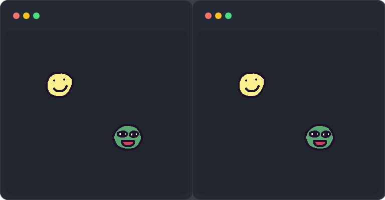
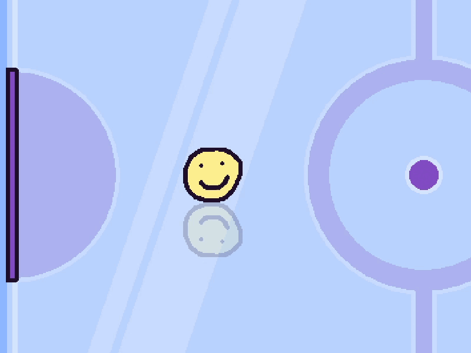
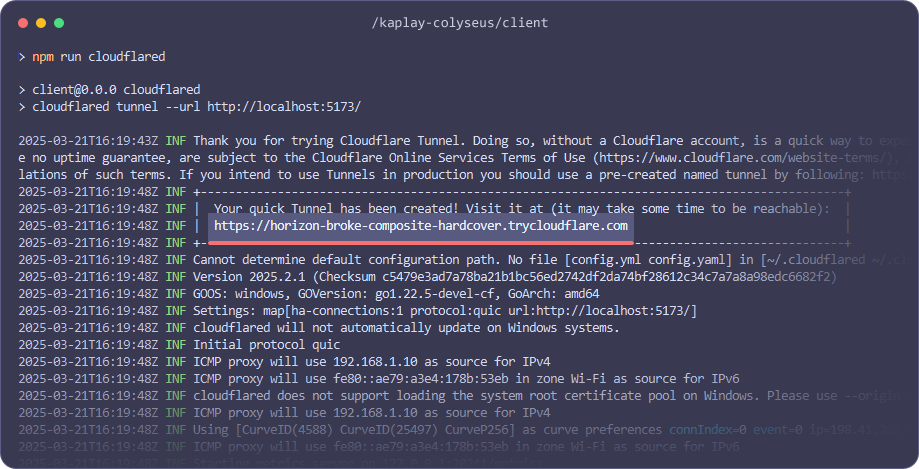

import Info from "@/components/Content/Info.astro";

# How to make a multiplayer game with Colyseus and KAPLAY


If you have ever dreamed about making a multiplayer game but had no idea where to start or found it too hard to give it a try, now it's great time to give it a shot! There are many options to implement multiplayer in your game, but this time we are going to do so with a particular one, that is very easy to work with!

## About Colyseus

**[Colyseus](https://colyseus.io/)** is a fully-featured open source multi-player framework. It's versatile and scalable for any game genre. The key features we are going to take an advantage of are automatic state synchronization and creating a game room on demand. Having this ready out-of-the-box is a great initial help so you can focus on your game itself, instead of doing (basically a lot of) boilerplate work. All these concepts and more will be explained further.

## **This guide will cover:**

- How to **get started** with [Colyseus](https://colyseus.io/)
- Explanation and creation of **state schemas** your game will and might use
- Creating a **simple game** with concepts mentioned
- Some **tips and tricks** by **Mark** himself (he's actually smart) :mark:

### **Prerequisites or good to know/have:**

- Same as **KAPLAY**'s: Node.js, npm and Git installed ideally
- There will be some TypeScript here and there, but very understandable
- Terms like client and server are shuffled a lot - client is either the game part of our client/server setup or person connecting to the server, server is the room/Colyseus part or dev server running in your terminal for each of them

<Info crew="mark" title="Grab a coffee or tea - it's going to be long but a fun one!"></Info>

Also, if you are not interested in multiplayer that much, it still might be worthwhile for you as you can still learn a lot in the game-making section. 😉

## How to get started with Colyseus

The easiest way to make a game with Colyseus is by using the official [KAPLAY + Colyseus quickstart repository](https://github.com/colyseus/kaplay).

1. Navigate to your project folder and clone the starting repository

```bash
git clone https://github.com/colyseus/kaplay.git kaplay-colyseus
```

2. Make it your own repository

```bash
# Linux (Bash)
cd kaplay-colyseus; rm -rf .git; git init; git add .; git commit -m "Init commit"

# Windows (PowerShell)
cd kaplay-colyseus; rm -r -Force .git; git init; git add .; git commit -m "Init commit"

# Windows (CMD)
cd kaplay-colyseus && rmdir /s /q .git && git init && git add . && git commit -m "Init commit"
```

<Info crew="mark" title="
    Git will make your life easier checking the file changes you have done since cloning the repository.
"></Info>

After doing so, created `kaplay-colyseus` folder should contain two folders, `client` and `server`. As you might already suspect, all KAPLAY code will reside in the former and Colyseus in the latter folder. The most important files to us will be `/server/src/rooms/MyRoom.ts` and `/server/src/rooms/schema/MyRoomState.ts`. We will get to the client one later on.

### How is KAPLAY (client) communicating with Colyseus (server)

First of all, alongside your regular KAPLAY setup, there is also a Colyseus npm package installed alongside. This is an SDK library that initiates connection and communicates with your Colyseus server running. It provides various helpful methods such as connection to the rooms, two-way state syncing, broadcasting and listening to the messages.

**The connection itself is done in two parts:**

1. Establishing the server connection with the endpoint of your server `/client/src/core/colyseus.ts`

    ```ts
    import { Client } from "colyseus.js";
    export const colyseusSDK = new Client(`${location.protocol}//${location.host}/colyseus`);
    ```

2. Connecting the client to it `/client/src/App.ts`

    ```ts
    import { colyseusSDK } from "./core/colyseus";
    const room = await colyseusSDK.joinOrCreate<MyRoomState>("my_room", { name: "Ka" });
    ```

<Info crew="mark" title="It really is that easy!"></Info>

### What are rooms in Colyseus

As we mentioned rooms multiple times and you could notice `rooms` folder and its files inside, it's the right time to talk about them a little more.

Room is basically a connection instance that players connect to. You can have many rooms like lobby and then game modes, but a single room is enough as well. You also define max clients per room, so when you have a game for 2 players, each couple will have their own separate room. And as soon as both players disconnect, the room is disposed, by the default. This will Colyseus do for you automatically, so you don't have to worry about anything. It's just good to know. 🙂

There is also a state of your game defined in the room and synced to clients. Room is also where you define all the events like `onJoin` or `onLeave`, as you might be guessing - when a player (client) connects or disconnects.

### How does room state work

In Colyseus for room state to work, you need to define a schema with all the properties your objects will have. For example, your room state will include players and each player will have an id, name, avatar, etc. Depending on the game type, also the other data like x and y position. You will define all of that in the state schema so room can expect and enforce data type on all these properties.

Example of the room state in `/server/src/schema/MyRoomState.ts`:

```ts
import { Schema, MapSchema, type } from '@colyseus/schema';

export class Player extends Schema { 
    @type('string') public sessionId: string; 
    @type('string') public userId: string; 
    @type('string') public avatar: string; 
    @type('string') public name: string; 
    @type("number") public x: number = 0; 
    @type("number") public y: number = 0;
}

export class MyRoomState extends Schema { 
    @type({ map: Player }) players = new MapSchema<Player>();
}
```

You can later send a message to the room to update the state. For example, updating your player's position:

In your game:

```ts
k.onClick(() => room.send("move", k.mousePos())); // { x: 200, y: 100 }
```

And listening on server side, inside of `onCreate` room event:

```ts
this.onMessage("move", (client, message) => { 
    const player = this.state.players.get(client.sessionId); 
    player.x = message.x; 
    player.y = message.y;
});
```

Client side, your `room.state` will be updated automatically, but you can also listen to changes yourself, like:

```ts
import { client, getStateCallbacks } from "colyseus.js";
// ...
const $ = getStateCallbacks(room);

$(room.state).players.onAdd((player, sessionId) => {
    // Listen to any instance change
    $(player).onChange(() => k.debug.log(`Player ${player.name} is alive!`));

    // Listen to a property change
    $(player).listen("x", (x, prevX) => k.debug.log("Player moved to", x, "from", prevX));
    $(player).listen("y", (y, prevY) => k.debug.log("Player moved to", y, "from", prevY));
});
```

`$` is a `getStateCallbacks` proxy helper imported from Colyseus SDK. You need to wrap the room state to be able to register `onChange` and `isten` listeners for their instance or property changes.

And finally, you can also `broadcast` your custom messages from the server with any data.

**On server:**

```ts
this.broadcast("chat", message);
```

**In game:**

```ts
room.onMessage("chat", (message) => k.debug.log(message));
```

<Info crew="mark" title="
    In general, all communication is based on updating the state, listening to its changes and broadcasting messages between the server and clients
"></Info>

There is also a nice breakdown for everything state related in the official [Colyseus documentation](https://docs.colyseus.io/state).

## Starting your game dev servers

Now that we have the basic knowledge of the library concepts and client-server communication, we are finally ready to start our dev servers. 🥳

First, we need to get our Colyseus server started:

```bash
cd server
npm install
npm start
```

Second, open new terminal tab/window and start your KAPLAY game dev server:

```bash
cd client
npm install
npm start
```

<Info crew="mark" title="
    For KAPLAY it's usually `npm run dev`, start is an alias for dev to match the Colyseus'
"></Info>

Navigate to your game at `http://localhost:5173`, you should see a simple KAPLAY setup with a random crew member! And you know what, open the game in another window, side by side and you got yourself the multiplayer part already working! ✨

<figure>
    
    <figcaption>Best friends. Twice.</figcaption>
</figure>

## Creating a fun game as an example

With the knowledge gained so far, you could already go and try to make a game yourself. But we are just getting started. There is much more to learn. Some (best) practices and caveats, depending on the game itself. And I think, by making an **Air Hockey game** is a good example to show many of them. As you might have been already suspecting from the thumbnail. 🙂

> The whole game code can be found [here](https://github.com/imaginarny/kaplay-colyseus), but we encourage you to code it with us along the guide.

---

**Let's summarize what our game will be about, it's features and restrictions:**

- Playground/field **size** similar to hockey
- **Two players** game, each **movement restricted to** their own **half** of the field. Imagine having a paddle that you move with your hand at the top of one of the sides of the table/field. You can't reach past your half.
- **Ice-like** sliding **physics** for players, puck, and bounciness when hitting the walls
- **Score** counting for goals, each goal resetting both players and the puck

### Common data

For the field size, we will create a separate `globals.ts` file at the root of the project, as we will need it for both, client, and server. This will ultimately be the canvas size and will be used to calculate spawn positions. We will address those later.

```ts
export const GAME_WIDTH = 800;
export const GAME_HEIGHT = 600;
```

### Updating state schema

From our game summary, we can already think of the state properties we will going to need (besides those we already have):

- Player team/side (simply “left” or “right”)
- Puck X & Y position coordinates
- Score for each team/side

Let's update the schema state file `/server/src/rooms/schema/MyRoomState.ts`:

```ts
// Player schema
export class Player extends Schema {
    // ...
    @type("string") public team: "left" | "right" = "left";
}
```

We added `team` for the player. See, TypeScript is here to define possible values. Still understandable even if you are still “team JavaScript” 🙂. We also set `"left"` as the default.

```ts
// Room schema (below the player)
export class MyRoomState extends Schema {
    @type({ map: Player }) players = new MapSchema<Player>(); 
    @type('number') public puckX: number; 
    @type('number') public puckY: number; 
    @type('string') public lastHitBy: string; 
    @type('number') public leftScore: number = 0; 
    @type('number') public rightScore: number = 0;
}
```

And these are the rest of the properties that are good enough to be defined right in the room state schema. For example, we could do separate schema for puck with x/y props, but it doesn't make much sense for a single object that has no multiple instances.

<Info crew="mark" title="
    You might need to restart the Colyseus dev server when updating the schema(s)
"></Info>

### Updating the room

Besides adding the new team property, we are also going to update max player count and some values to address the game dimensions we earlier prepared globals for. Add to the top of the `/server/src/rooms/MyRoom.ts` file:

```ts
import { GAME_WIDTH, GAME_HEIGHT } from "../../../globals";
```

Next we change the max players count from 4 to 2 and add a little helper method for the player count per team:

```ts
// ...
export class MyRoom extends Room { 
    maxClients = 2;
    state = new MyRoomState();

    teamPlayersCount(team: "left" | "right" = "left") {   
        return [...this.state.players.values()].filter(p => p.team == team).length; 
    }
```

Now, within the same file, find the `onJoin` method and update it so `team` is assigned to the player once joined and change the spawn positions from random to the center of the side (quarter), depending on the team:

```ts
onJoin (client: Client, options: any) {   
    console.log(client.sessionId, "joined!");

    const player = new Player();   
    player.team = this.teamPlayersCount() % 2 ? "right" : "left";
    player.x = player.team == "left" ? GAME_WIDTH / 4 : GAME_WIDTH - (GAME_WIDTH / 4);   
    player.y = GAME_HEIGHT / 2;
    //...
}
```

You might wonder why assigning team by even number. That's if we later decide to increase the max player count, so users will join each team evenly in altered way.

Now, if you open your game three times, you can see you will be alone in the third one. That means the max player count is working. We can also see the players spawn on fixed spots but it's not quite at the sides of the screen yet, as we haven't updated our canvas size yet. Let's fix that.

### Updating the game

First things first, let's update our KAPLAY library to `^4000.0.0-alpha.17` to get some goodies that will help with our game. Namely, circle shapes for collisions. You know, the puck is round. And `restitution` option to make the puck bounce off the walls. Instead of doing it ourselves, since we have a lot ahead of us. 🙂

```bash
cd client
npm install kaplay@^4000.0.0-alpha.17
```

<Info crew="mark" title="Don't forget to re-run the client dev server"></Info>

Now, let's change the general setup of our game. Such as canvas size mentioned, so it's the same for both players and not affected by their screen size. And other options like background.

We will add these options to the `kaplay()` init function, update `/client/src/App.ts` file like this:

```ts
import './index.css';
import { GAME_WIDTH, GAME_HEIGHT } from "../../globals";
// ...

// Initialize kaplay
export const k = kaplay({ 
    width: GAME_WIDTH, 
    height: GAME_HEIGHT, 
    letterbox: true, 
    pixelDensity: Math.min(window.devicePixelRatio, 2), // crispier on phones
    background: "8db7ff",
});
```

At this point, I think we would benefit of having a nicer background to look at, which will also help us visualize the movement restriction we will do next. But let's not get ahead of ourselves and add the playground first!

We will create a new folder `/client/src/objs` where we will put all of our future objects. Each file will export an array of components, as it's what an object is composed in KAPLAY of.

Let's create `playground.ts` in the folder. It will be basically an object with boundaries to keep the puck in, field background and the goal nets. We could use one sprite for all of that, but we are going to draw it all in KAPLAY instead! 😮

```ts
import { k } from "../App";
import type { GameObj } from "kaplay";

export default () => ([ 
    k.pos(), 
    k.z(0),
    {
        add(this: GameObj) {
            const thickness = 500;
            const bleed = 5;

            this.boundaries = [
                { x: -thickness, y: -thickness, w: k.width() + thickness * 2, h: thickness + bleed },
                { x: -thickness, y: k.height() - bleed, w: k.width() + thickness * 2, h: thickness + bleed },
                { x: -thickness, y: -thickness, w: thickness + bleed, h: k.height() + thickness * 2 },
                { x: k.width() - bleed, y: -thickness, w: thickness + bleed, h: k.height() + thickness * 2 },
            ].map(({ x, y, w, h }) => {
                this.add([
                    k.pos(x, y),
                    k.rect(w, h, { fill: false }),
                    k.area({ collisionIgnore: ["boundary"] }),
                    k.body({ isStatic: true }),
                    "boundary",
                ]);
            });
        },
    },
]);
```

Here we added invisible boundaries, that are outside of our screen, but bleed 5 pixels in. So if we enabled rectangles fill, we would see just 5px lines instead of 500px. Also, with thickness like that, we ensure the puck won't break out instead of bouncing away. It will be rejected back to the field as the distance back would be shorter than past it, if it manages to get a few pixels in (physics are updated at 50fps). I thought Mark was smart enough to say it himself.

<Info crew="mark" title="I'm smart. *I'm am!*"></Info>

Also, we added them to `collisionIgnore` array as they would be touching continuously forever and we don't need to waste our resources on it. We made them static as well, as they should never move.

Let's continue with the field, right under the `this.boundaries` code. We will center it as it will be easier to draw from the center as well:

```ts
const field = this.add([
    k.anchor("center"),
    k.pos(k.center()),
    k.rect(k.width() - 20, k.height() - 20, { radius: 100 }),
    k.outline(10, k.WHITE),
    k.opacity(0.4),
]);
```

I don't have anything smart to say about this either, so let's just add the nets as well right after:

```ts
const nets = [-1, 1].map(side => field.add([
    k.anchor("center"),
    k.pos(field.width / 2 * side, 0),
    k.rect(8, 200, { radius: side == -1 ? [0, 2, 2, 0] : [2, 0, 0, 2] }),
    k.color(k.Color.fromHex("834dc4")),
    k.outline(4, k.Color.fromHex("1f102a")),
    k.area({ collisionIgnore: ["boundary", "player"] }),
    "net",
    {
        team: side == -1 ? "left" : "right",
    },
]));
```

There are two things interesting here. The first one is that we are doing nets for both left and right side in one go and we are setting the `net.team` property for us to use later, for example to determine what net was scored into. And similarly, we don't need the collisions to bother with boundaries or players.

<Info crew="mark" title="Nets are only interested in puck 😳"></Info>

I promised we will draw the field in KAPLAY. We will do so in one draw event, right below the `nets` like this (brace yourself):

```ts
field.onDraw(() => {
    k.drawMasked(() => {
        // Background center circle
        k.drawCircle({
            radius: 114,
            color: k.Color.fromHex("c9ddff"),
        });

        // Middle line
        k.drawRect({
            anchor: "center",
            height: field.height - 5,
            width: 20,
            color: k.Color.fromHex("adb2f0"),
            outline: {
                width: 4,
                color: k.Color.fromHex("c9ddff"),
            },
        });

        // Foreground center circle
        k.drawCircle({
            radius: 100,
            color: k.Color.fromHex("bbd4ff"),
            outline: {
                width: 20,
                color: k.Color.fromHex("adb2f0"),
            },
        });

        // Small middle circle
        k.drawCircle({
            radius: 16,
            color: k.Color.fromHex("834dc4"),
            outline: {
                width: 4,
                color: k.Color.fromHex("d6e5ff"),
            },
        });

        // Nets :)
        nets.forEach(net => {
            k.drawCircle({
                anchor: "center",
                pos: net.pos,
                radius: net.height / 2,
                color: k.Color.fromHex("adb2f0"),
                outline: {
                width: 4,
                color: k.Color.fromHex("c9ddff"),
                },
            });
        });

        // Reflections
        [
            [-450, 20], [-400, 60],
            [0, 60], [50, 20],
        ].forEach(([x, w]) => k.drawLine({
            p1: k.vec2(x + 400, -field.height),
            p2: k.vec2(x, field.height),
            width: w,
            opacity: 0.2,
        }));
    }, () => {
        // Field mask
        k.drawRect({
            anchor: "center",
            width: field.width - 10,
            height: field.height - 10,
            radius: +(field?.radius ?? 100) - 10,
        });
    });
});
```

It looks complicated but there is no science to it. The only thing worth mentioning here is that we used `drawMasked()`, so any overflowing drawings, like the net circles, are cut off to not overflow the field. Field rectangle excluding the outline is used as a mask.

And finally, let's import the playground to the game, in `/client/src/scenes/lobby`:

```ts
// at the top after the other imports
import playground from "../objs/playground";

export function createLobbyScene() {
    k.scene("lobby", (room: Room<MyRoomState>) => {
        k.add(playground());
        // ...
```


<Info crew="mark" title="Finally something nicer to look at."></Info>

### Player movement

Now that we have a reference point where the middle line is, let's implement the player object with restricted mouse movement that we defined as a game pattern earlier. Similar as you would use your hand to move the air-hockey paddle.

To better separate concerns in our code, we will create a `player.ts` file in our `/client/src/objs` folder:

```ts
import type { GameObj, Vec2 } from "kaplay";
import type { MyRoomState, Player } from "../../../server/src/rooms/schema/MyRoomState";
import { k } from "../App";
import { Room } from "colyseus.js";

// Needs room state and player instance for server communication and player data
export default (room: Room<MyRoomState>, player: Player) => ([
    k.sprite(player.avatar, { flipX: player.team == "right" }), // player on the right side will face center
    k.pos(player.x, player.y), // initial pos by server
    k.anchor("center"),
    k.area({ shape: new k.Circle(k.vec2(0), (k.getSprite(player.avatar)?.data?.width ?? 32) * 0.4) }), // smaller area than sprite to not collide with transparent parts
    k.body({ isStatic: true }), // won't be affected/moved when hit
    k.scale(0), // we will scale-in player on spawn
    k.z(player.y), // update Z sorting as well by matching it to Y
    "player",
    {
        // Define a bunch of useful properties
        sessionId: player.sessionId,
        team: player.team,
        startPos: k.vec2(player.x, player.y),
        moveLerp: 12, // for position interpolation
        overshootLerp: 30, // for fast movement interpolation
        controllable: true, // e.g. disable when resetting player on goal
```

So far this is the base object for our player with more or less simple values. You can see some `lerp` properties, we will address those later. Let's continue with some more complicated ones for the restricted movement itself and the logic how the position will be updated and synced.

```ts
    add(this: GameObj) {
        // Scale player in with nice transition once added
        k.tween(this.scale, k.vec2(1), 0.25, v => this.scale = v, k.easings.easeOutBack);

        // Raytracing :)
        this.add([
            k.anchor("center"),
            k.sprite(player.avatar, { flipX: this.flipX, flipY: true }),
            k.pos(0, k.getSprite(player.avatar)?.data?.height ?? this.height),
            k.opacity(0.2),
        ]);

        const moveOffset = {
            x: this.width / 2,
            y: this.height / 2,
            overshoot: 10,
        };

        this.moveMinMax = {
            x: Object.values(player.team == "left" ? {
                min: moveOffset.x,
                max: k.width() / 2 - moveOffset.x + moveOffset.overshoot,
            } : {
                min: k.width() / 2 + moveOffset.x - moveOffset.overshoot,
                max: k.width() - moveOffset.x,
            }),
            y: Object.values({
                min: moveOffset.y,
                max: k.height() - moveOffset.y,
            })
        };

        if (player.sessionId == room.sessionId) onLocalPlayerCreated(room, this);
    },
  },
]);
```

<Info crew="mark" title="
    The most important thing here is we added raytracing for players by flipping the player sprite by Y axis and positioning it under the player. Reflections kinda work like that.
"></Info>

Well, the actual most important thing here is the `moveMinMax`, the minimum and maximum position coordinates for the players. Player on the left side, can move from 0 to half of the screen, where the middle line is. With player object size taken into account, as well as the `overshoot`. We have that so you can go slightly past the line, to not loose all the momentum right in front of it, like when trying to hit the puck in the center, but barely reaching it.

If you are confused seeing `Object.values`, it's just to visualize the min and max better than in a simple array. As the array will be easier to use in code later. And last but not least, we will call `onLocalPlayerCreated()` function that we are going to code next.

<Info crew="mark" title="
    To determine if the player is the “local” one (you and not the others) we can compare `player.sessionId` and `room.sessionId`. Those will be the same in that case.
"></Info>

Why do we need the “local” player you may ask? Well, for example, we want you to control just one of the player objects. The one that belongs to you. Among the many other occasions where you need to think of if the event should trigger for all, or just for you, or if you want to sync your state and let the other's sync theirs.

So let's create the `onLocalPlayerCreated()` function, at the end of the file:

```ts
function onLocalPlayerCreated(room: Room<MyRoomState>, playerObj: GameObj) {
    // differentiate local player with tag
    playerObj.tag("localPlayer");

    // save mouse pos locally
    let mousePos = playerObj.startPos;
    const [moveMinX, moveMaxX] = playerObj.moveMinMax.x;
    const [moveMinY, moveMaxY] = playerObj.moveMinMax.y;

    const move = (_: Vec2, delta: Vec2, isMouse = true) => {
        if ((isMouse && !k.isCursorLocked()) || !playerObj.controllable) return;

        const { x, y } = mousePos;
        const newX = x + delta.x;
        const newY = y + delta.y;

        mousePos = k.vec2(
            k.clamp(moveMinX, newX, moveMaxX),
            k.clamp(moveMinY, newY, moveMaxY)
        );

        room.send("move", mousePos);
    };

  k.onMouseMove(move);
}
```

Here, in the move function, we are checking if player has cursor locked - players will have to click first to take control so their cursor won't fly out of the window losing focus and control. In general, to update new position, we would do `axis + delta.axis`, but the movement is clamped and isn't applied to the player object immediately. Instead is sent to the server, where we will account for latency as well. Let's head back to our player object above, and update the players position so you can understand it better. Add this below the `add()` function:

```ts
    update(this: GameObj) {
        this.pos.x = k.lerp(
            this.pos.x,
            player.x,
            k.dt() * (this.moveMinMax.x.includes(player.x) ? this.overshootLerp : this.moveLerp)
        );
        this.pos.y = this.z = k.lerp(
            this.pos.y,
            player.y,
            k.dt() * (this.moveMinMax.y.includes(player.y) ? this.overshootLerp : this.moveLerp)
        );
    },
```

First of all, notice we use `player.x` and `player.y`. This comes right from our server state which is always updated, especially as we are sending new position with `room.send("move", mousePos);` on mouse move event. Instead of applying it directly to the object pos as e.g. `this.pos.x = player.x`, we are going to apply linear interpolation `k.lerp()` between those values. That makes the movement smooth instead of being laggy or jumpy, as the server updates the value with a slight delay. We stored the lerp amount value as the property `this.moveLerp`. Basically, lower the number, the smoother the movement will be. But also slower and with higher delay, so with `12` we found a good middle-ground. But that isn't all. We are also accounting for the mouse overshoot, when you try to move it rapidly and hit the max position. Instead of going to the max quickly, you would see it going slowly in the curve and slowing down gradually, as you would get to the end position later due to the lerp. This image should make it more clear.


In that case, we check if player's final position is at the max (or min) and increase the lerp amount to a higher value `this.overshootLerp`. That way player can zoom there much more quickly and by that you eliminate the curve that would happen otherwise. The curve is also happening because even if you think you are moving with mouse in a perfect straight line, once you reach the max abruptly, you also move your hand up or down, naturally. And this looks much more exaggerated once you hit the imaginary barrier earlier than you anticipate and move your mouse past it.

All that is running in `update` function each frame and the lerp value is multiplied by the delta time (time passed since the last frame update).

You might also wonder why we are not updating the player pos immediately and send it to the server first. You could do that, but by sending first we are making both players have the same movement, making the server to have “the last word” over the pos, which makes it more fair and visually equal. And as a bonus, we are getting an on-ice effect as well.

<Info crew="mark" title="
    This is close to the “server authority” but not quiet. Real server authority would be if we were sending just movement inputs and calculate player's coordinates server side. In this case, server would only have the state authority, but clients still control state of their objects, making it shared authority instead.
"></Info>

### Using our player object

Right now, you can see players spawn on their half, but you can still point & click to move anywhere instead. Code responsible for that is somewhere in the `/client/src/scenes/lobby.ts` file. If you have managed to find it on your own, you can ask for a digital banana sticker on our [Discord](https://discord.com/invite/aQ6RuQm3TF) (while the supply lasts). We will change the file gradually and get there. Add to the top after the other imports:

```ts
import player from "../objs/player";
```

Find these lines with `onAdd` listener and replace them like this:

```ts
// listen when a player is added in server state
$(room.state).players.onAdd(async (player, sessionId) => {
    spritesBySessionId[sessionId] = await createPlayer(room, player);
});
```

We changed it to be asynchronous. You might have noticed we haven't used any sprite loading yet. We will change that for `createPlayer()`. But let's replace that click to move code first with this, along the way down at the bottom of the scene function:

```ts
k.onClick(() => {
    k.setCursorLocked(true);
});
```

We will still use mouse for the movement (obviously). And as that can be really frantic at times, we will lock the cursor to the canvas so you don't move away from the window accidentally. Which would result in player stopping, as we mentioned earlier. We have moved the movement logic to the `player` itself already.

So let's change `createPlayer()` function to use our player object:

```ts
async function createPlayer(room: Room<MyRoomState>, playerState: Player) {
    await k.loadSprite(playerState.avatar, `assets/${playerState.avatar}.png`);
    await k.getSprite(playerState.avatar);
    return k.add(player(room, playerState));
}
```

As you can see, we made it asynchronous to load player's avatar as a sprite first and made sure sprite data are loaded as well, before we create `player` object and return it.

Now, you can test the silly movement we have worked on so hard! 🥳



<Info crew="mark" title="Woah, ice is slippery. Ok, I'm cold now."></Info>

### Adding the puck

So far it looks relatively simple with the movement client/server-wise, but syncing physics is a huge topic. Maybe for multiple guides with different approaches. Especially, when syncing a fast paced object like a puck that players interact with. You could do physics server-side, choose one client to be a “host”, determine the outcome and sync it to the other clients, etc... Or we can be smart and do something you wouldn't have a headache from.

As the Air Hockey is basically one player hitting puck at the time, we can switch the “host” or **authority** - player that will let the physics to play out as they happen, and just sync it to the others. As soon as someone hits the puck, it changes them to be the host/authority. This way you get 100% accuracy where the puck is supposed to go, as the player hitting (you) is dictating it. If we were just syncing position of the puck itself, the chances the puck would go two different ways is very high as there can be a difference of just a few pixels when the hit happens for both players depending on their last updated position. Thanks to the **authority switching**, you avoid that by having the one source of truth at the time.

Let's create the puck object, at our usual objects location `/client/src/objs/puck.ts`:

First, we import all things used, as always:

```ts
import { k } from "../App";
import { getStateCallbacks, Room } from "colyseus.js";
import type { MyRoomState } from "../../../server/src/rooms/schema/MyRoomState";
import type { Collision, DrawRectOpt, GameObj } from "kaplay";
```

Next, we define a couple of constants we will use. The puck `size` and the center `startPos`:

```ts
const size = 48;
const startPos = () => (k.center().sub(0, 6));
```

We made `startPos` a function to recalculate the center, just in case. Also, the `sub` part is an offset to compensate the fake 3D perspective it has.

And now to the object itself:

```ts
export default (room: Room<MyRoomState>) => ([
    k.pos(startPos()),
    k.anchor("center"),
    k.area({
        shape: new k.Circle(k.vec2(0), size / 2),
        restitution: 0.2, // bounciness
    }),
    k.body(),
    k.scale(0), // we will scale-in the puck on spawn
    k.z((k.height() - size) / 2), // starting Z is the the center of Y
    "puck",
    {
        add(this: GameObj) {
            const $ = getStateCallbacks(room);
            const localPlayerId = room.sessionId;

            // scale the puck in
            // delay it if joining mid-game/resetting
            k.wait(room.state.puckX || room.state.puckX ? 1.25 : 0, () =>
                k.tween(this.scale, k.vec2(1), 0.25, v => this.scale = v, k.easings.easeOutBack));

            this.onCollide("localPlayer", (_: GameObj, col: Collision) => {
                // inform server of the hit
                room.send("puck", { ...this.pos, hit: true });
                // reset the current velocity
                this.vel = k.vec2(0);
                // simulate new hit with force by scaling the collision direction
                this.applyImpulse(col.normal.scale(col.distance).scale(100));
            });

            this.onCollide("boundary", () => {
                k.shake(2);
            });

            // reset velocity when lastHitBy changes as at this point the other player will only listen for the pos change
            $(room.state).listen("lastHitBy", (id) => {
                if (id == localPlayerId) return;
                this.vel = k.vec2(0);
            });

            this.onCollide("net", async (net: GameObj) => {
                // inform server only once, when local player registers the hit
                if (room.state.lastHitBy != localPlayerId) return;

                k.addKaboom(k.vec2(k.clamp(100, room.state.puckX, k.width() - 100), room.state.puckY), { scale: 0.8 });

                room.send("goal", net.team);
                room.send("puck", startPos());
            });

            // update puck depending on authority/local player
            this.onUpdate(() => {
                // when local player is authority, just report the puck pos
                if (localPlayerId == (room.state?.lastHitBy ?? localPlayerId)) {
                    room.send("puck", this.pos);
                // when player isn't authority, lerp the reported pos
                } else {
                    this.pos.x = k.lerp(this.pos.x, room.state.puckX, 12 * k.dt());
                    this.pos.y = k.lerp(this.pos.y, room.state.puckY, 12 * k.dt());
                }

                // sync Z sorting by the Y axis
                this.z = this.pos.y;
            })
        },

        draw() {
            const side: DrawRectOpt = {
                pos: k.vec2(0, size / 4),
                anchor: "center",
                width: size,
                height: size * 0.75,
                color: k.Color.fromHex("4a3052"),
                outline: {
                    width: 4,
                    color: k.Color.fromHex("1f102a")
                },
                radius: [8, 8, size, size],
            };

            // Raytracing :)
            k.drawRect({ ...side, pos: side.pos?.scale(2), opacity: 0.2 });

            k.drawRect(side);

            k.drawEllipse({
                anchor: "center",
                radiusX: size / 2,
                radiusY: size / 2 - 4,
                color: k.Color.fromHex("7b5480"),
                outline: {
                width: 4,
                    color: k.Color.fromHex("1f102a"),
                },
            });
        },
    },
]);
```

The biggest point to take from this code is, that we had to think of how to setup collisions and when to send the puck data or when to just apply them. Once again, the local player is the one who is the authority of the puck physics, so as soon it's hit, besides sending the new pos, it informs about the hit itself `room.send("puck", { ...this.pos, hit: true });`. Then, it's checked in `onUpdate` if the `lastHitBy` was the local player. In that case, it continues in sending updates of the puck's position, each frame. Or if not, it means it's the other player, which will just apply the updated position from the `room.state`.

Another thing to mention is, that whenever the `lastHitBy` changes, we need to reset puck's velocity for the other player, otherwise it would battle with the manual position that is sent and applied from the server. It would make the puck shake if the other player hit the puck, but the local player didn't register that hit, due to the latency or lerp.

Besides the position and player hit event, we have already set up the goal event, when it collides with the net. It explodes, of course, then informs the server about it and resets its pos. We will expand on this later, when we implement the score. But for the `"puck"` event to work, we still need to listen for it on the server. So let's head to the `/server/src/rooms/MyRoom.ts` and add the listener to `onCreate`, below the `"move"` event:

```ts
this.onMessage("puck", (client, message) => {
    if (message?.hit) this.state.lastHitBy = client.sessionId;
    this.state.puckX = message.x;
    this.state.puckY = message.y;
});
```

And finally, let's import it to the game scene itself `/client/src/scenes/lobby.ts`:

Below the other imports:

```ts
import puck from "../objs/puck";
```

In the lobby scene function opening code, below the playground object:

```ts
k.scene("lobby", (room: Room<MyRoomState>) => {
    k.add(playground());
    k.add(puck(room));
    // ...
```

Finally, we can have some fun on the field! Although, we have to finalize the goal mechanic and the score.

### Goal! & The Score

If you were paying attention, you would remember we were already sending the `"goal"` message when the puck hits the net. Let's head back to the server code and listen for it. In the `/server/src/rooms/MyRoom.ts` we will add a new listener below the `this.onMessage("puck", ...)`:

```ts
this.onMessage("goal", (client, teamNet) => {
    const team = teamNet == "left" ? "right" : "left";
    this.state[`${team}Score`] += 1;
    const pad = Math.max(this.state.leftScore, this.state.rightScore).toString().length;

    this.broadcast("score",
        `${String(this.state.leftScore).padStart(pad, "0")}:${String(this.state.rightScore).padStart(pad, "0")}`
    );
});
```

Notice that the team score is the opposite one than the net that puck went in. We are also doing a fancy formatting, padding the number to be the same digits length, e.g. 0:0, 10:00. Then you should notice we are doing `this.broadcast("score", ...);` to send the message to all clients, so we can easily listen to this event.

<Info crew="mark" title="
    We are doing fancy things. I might open a champagne.
"></Info>

We are getting close, but we are not done yet. We need to do multiple things and edit multiple files to address the goal/scoring.

Let's start with the puck as we might still have it in mind. It's at the `/client/src/objs/puck.ts` if you forgot like Mark did. Find the line with net collision `this.onCollide("net", ...);` and add below the new message listener:

```ts
room.onMessage("score", async (score) => {
    // reset puck physics
    this.vel = k.vec2(0);
    // ignore player collisions until we start new round
    this.collisionIgnore.push("player");

    // add some effects
    if (score != "0:0") {
        k.shake(10);
        k.flash(k.getBackground() ?? k.WHITE, 0.25);
        k.burp();
    }

    // scale out the puck before resetting it
    await k.tween(this.scale, k.vec2(0), 0.25, v => this.scale = v, k.easings.easeOutQuad);
    room.send("puck", startPos());
    this.pos = startPos();

    // scale it in after round starts and restore player collisions
    k.wait(1, () => {
        this.collisionIgnore = this.collisionIgnore.filter((c: string) => c != "player");
        k.tween(this.scale, k.vec2(1), 0.25, v => this.scale = v, k.easings.easeOutQuad);
    });
});
```

With this code we added some sort of rounds mechanic. Puck will disappear and reappear after one second after scoring to the net. At the same time, we are going to reset players to their starting positions as well. In the meantime, we disabled the collisions for the accidental hits while doing so. Let's implement it for the players as well.

Open `/client/src/objs/player.ts` and scroll down to the `onLocalPlayerCreated` function. We will add new listener, above the `const move`:

```ts
room.onMessage("score", () => {
    mousePos = playerObj.startPos;
    playerObj.controllable = false;
    room.send("move", mousePos);

    k.wait(1.25, () => playerObj.controllable = true);
});
```

I think this code is fairly self-explanatory. But Mark needs it to be summed up. We are resetting our local `mousePos` to the player's start position, disabling player movement by using the `controllable` property that we have prepared earlier for, sync the position back to the server, and make the player controllable again after the new round starts.

<Info crew="mark" title="
    Lovely. But I'm winning and no one will believe me as there is no score shown!
"></Info>

### Adding the score object

Before we add the score info to the game, let's download a nicer font and set it as the default.

Get the font by right clicking [this link](https://raw.githubusercontent.com/imaginarny/kaplay-colyseus/refs/heads/main/client/public/assets/happy-o.png) and save it as `happy-o.png` to the `/client/public/assets` folder. Then open the `/client/src/App.ts` file and change the default font in the `kaplay()` init options:

```ts
// Initialize kaplay
export const k = kaplay({
    // ...,
    font: "happy-o",
});
```

Load the font right at the start of the `main()` function:

```ts
async function main() {
    await k.loadBitmapFont("happy-o", "assets/happy-o.png", 31, 39);
    // ...
```

Also, update the joining text font size below:

```ts
const text = k.add([
    k.text("Joining room ...", { size: 28 }),
    // ...
```

And the final “puzzle” to our game is the score object itself. So let's create it at `/client/src/objs/score.ts`:

```ts
import { k } from "../App";
import { Room } from "colyseus.js";
import type { MyRoomState } from "../../../server/src/rooms/schema/MyRoomState";
import type { GameObj } from "kaplay";

export default (room: Room<MyRoomState>) => ([
    {
        textWidth: 24 * 3,
        draw() {
            k.drawRect({
                anchor: "top",
                pos: k.vec2(0, -6),
                width: this.textWidth + 30,
                height: 54,
                radius: [0, 0, 16, 16],
                color: k.Color.fromHex("1f102a"),
                opacity: 0.8,
            })
        },
    },
    k.anchor("top"),
    k.pos(k.width() / 2, 6),
    k.fixed(),
    k.z(9999),
    k.text(`${room.state.leftScore ?? 0}:${room.state.rightScore ?? 0}`),
    k.animate(),
    {
        add(this: GameObj) {
            this.textWidth = this.width;

            room.onMessage("score", (score) => {
                this.text = score;
                this.textWidth = this.width;

                this.animation.seek(0);
                this.animate("scale", [k.vec2(1), k.vec2(0.75, 1.05), k.vec2(1.2), k.vec2(1)], {
                    duration: 0.2,
                    loops: 1,
                });
            });
        },
    },
]);
```

We added a small bar to the top of the screen, centered horizontally. And made it fixed and on top of everything as well, so it's not affected by the game underneath. The most important part is that we listen to `"score"` message and update the in-game score with received updated score string. As a bonus, we added a little animation to nudge the whole score bar as well.

And finally, let's import it in the lobby scene, as always `/client/src/scenes/lobby.ts`:

In the beginning of the file, below the other imports add:

```ts
import score from "../objs/score";
```

And `add` it below the other objects in the `createLobbyScene` function:

```ts
export function createLobbyScene() {
    k.scene("lobby", (room: Room<MyRoomState>) => {
        k.add(playground());
        k.add(puck(room));
        k.add(score(room));
        // ...
```

<Info crew="mark" title="
    Too bad we are finally getting the hang of it towards the end. Or actually, nice job learning the ropes!
"></Info>

Nice indeed. I think we got us some Air Hockey game. 🥳


### Resetting the game

Hold on! We forgot one thing about the score. Mark almost tricked us so he can cheat. When one of the player leaves, the other would keep the score. So Mark could be winning immediately after you join. Same when he starts playing alone. We need to reset the game, when any player joins or leaves!

Let's head to the `/server/src/rooms/MyRoom.ts` and find both `onJoin` and `onLeave` events. Add the following as the last lines in the each of them:

```ts
this.state.leftScore = 0;
this.state.rightScore = 0;

this.broadcast("score", "0:0");
```

Not only we reset the score, but we also informed the remaining player. For that, we reused the `"score"` message that our game already implemented. It resets the puck's position to the center, player to its initial position and resets the score as well. Neato, finito.

<Info crew="mark" title="
    Note that when the second player joins, it could take a few seconds until the player object is created and spawned. Ideally, you should wait for that instead when resetting or starting the round, if you are letting the first player to play on their own in the meantime, as we do.
"></Info>

## Where to go with the game next

We could improve it further (and forever). By adding some small features, like doing countdown after each goal with proper round timing. Or some bigger ones, like adding the goalkeepers! I think that could be your homework.

Although, we surely all agree it could use at least a one more sound, besides the burp one on goal (this one will have to stay). And it's the sound of the puck hitting the wall. And the player hitting the puck (although adding burp here is tempting too).

Ok, right click [this link](https://github.com/kaplayjs/kaplay/raw/refs/heads/master/examples/sounds/hit.mp3) to download the sound and save it to the new folder at `/client/public/sounds` as `hit.mp3`.

Load it in the `/client/src/App.ts` file, in the `main()` function below the `k.loadFont(...);`:

```ts
k.loadSound("hit", "sounds/hit.mp3");
```

Now, you might think this is going to be an easy change and we chose it because of the sake of it. Quite the opposite. And you will learn one more important thing.

Normally, we would do something for the puck object, like this:

```ts
this.onCollide("boundary", () => k.play("hit"));
```

But this will only play when the local player is the authority. It's due to the puck's position either being lerped, or having a latency. So there is a very high probability that when the other player hits the puck to the wall, it won't sync position for you exactly when the puck hits the wall. We will have to split it for the local player, and the other players as well, similarly as we were doing with the puck position. And instead of limiting it only to the sound, let's also make it more general, to give you one more idea how to sync in-game events and data.

### Events & data syncing

Let's implement it on the server side first. We will listen for `"event"` message and broadcast another message to all clients, based on received data. Open `/server/src/rooms/MyRoom.ts` and add this below the `this.onMessage("goal", ...);`:

```ts
this.onMessage("event", (client, { name, exceptLocal, data }: { name?: string; exceptLocal?: boolean; data?: any } = {}) => {
    this.broadcast(name ? `event:${name}` : "event", data, exceptLocal && { except: client });
});
```

We are expecting the second message argument to be an object, with the optional `name` property like `"hit"`, optional `exceptLocal` to exclude the “sender” and any `data` (we will use it later). Once server receives this event message, we will `broadcast` another one to inform all clients, optionally except the local one. We have already used `broadcast` once, but we haven't used the `except` option it offers. So thanks to that, the message will be broadcast only to the other players without any additional work on our part!

First, we will add the hit sound on collision with `"localPlayer"`. Open the `/client/src/objs/puck.ts`, find the `this.onCollide("localPlayer", ...);` and update it like this:

```ts
this.onCollide("localPlayer", (_: GameObj, col: Collision) => {
    room.send("puck", { ...this.pos, hit: true });
    this.vel = k.vec2(0);
    this.applyImpulse(col.normal.scale(col.distance).scale(100));
    k.play("hit");
});
```

And for the other players, add this below the `"localPlayer"` collision code:

```ts
this.onCollide("player", (obj: GameObj) => {
    if (obj.is("localPlayer")) return;

    room.send("event", { name: "hit" });
});
```

We are checking if the player isn't local one, meaning the other player. In that case we send the hit event. All players will listen to this event.

In the similar fashion, we are going to update `"boundary"` collision as well, it's right below it:

```ts
this.onCollide("boundary", () => {
    if (room.state.lastHitBy != localPlayerId) return;

    k.shake(2);
    k.play("hit");
    room.send("event", { name: "hit", exceptLocal: true, data: "boundary" });
});
```

First, we are checking if the `localPlayer` is currently the authority, meaning the source of truth of the puck movement and the hit. Server will inform us about this hit instead. However, we are excluding the local player from receiving this event as the sound already played for them. Otherwise we could potentially hear the hit twice. This time we are also sending `data` property to differentiate the hit target. When hitting the walls, we are also shaking the screen.

Final code to listen for the hit event sent by the other players will look like this. Paste it below:

```ts
room.onMessage("event:hit", async (target) => {
    k.play("hit");
    if (target == "boundary") k.shake(2);
});
```

This was and always will be confusing. We could do it easier, by not playing any sound for the “local” or “authority” player first and just send the event in all cases to listen to. This although could introduce some delay, when the latency is high, or duplication as already mentioned. Nevertheless, this caveat is good to know about and more importantly, know how to solve it.

### Syncing the other collisions

Now that we have another trick upon our sleeve, let's fix another collision that is not syncing. You might have noticed that the kaboom animation on goal is only showing for the player that scored. Or in other words, the local one with authority over the puck. This is also because of the lerp and the latency. For the local player, the puck collides with the net. But that doesn't happen for the other player, they are just informed about it. You can try to fix it yourself to test if you understood the past learning, it's very simple this time, just moving one line. Or, you can continue with us right away.

Once again, we are going to edit `/client/src/objs/puck.ts`. Find the `this.onCollide("net", ...);` function and remove the `k.addKaboom(...);` line. We are moving it to the `room.onMessage("score", ...);` listener, right after the `if (score != "0:0") {` condition opening. Like this:

```ts
if (score != "0:0") {
    k.addKaboom(k.vec2(k.clamp(100, room.state.puckX, k.width() - 100), room.state.puckY), { scale: 0.8 });
    // ...
```

An easy fix, at last. Now the kaboom is added for both players, as both players are informed about the score update at the same time after scoring a goal.

### “Sync” about it

You will always have to think, if the thing you are doing will happen for both players and/or needs to be synced. For that case, now you should know the idea of “local” player and all the syncing methods available.

<Info crew="mark" title="Let that pun “sync” in. 🙊🙂"></Info>

## Bonus: Adding touch support for easier multi-device testing

Nowadays, almost everyone owns a smartphone. And you can't play with one mouse in two browser windows at the same time. So it makes sense that you would like to try play-testing against yourself more interactively and use your phone as the second player. Let's add support for it, it's going to be a quick one!

Open `/client/src/objs/player.ts` and look for the `let mousePos = playerObj.startPos;` line. Add new variable below it:

```ts
let mousePos = playerObj.startPos;
let touchPos = playerObj.startPos;
```

Now, look for the `k.onMouseMove(move);` line. Add this code below it:

```ts
k.onTouchStart(pos => touchPos = pos);
k.onTouchMove((pos) => {
    move(pos, pos.sub(touchPos).scale(window.devicePixelRatio), false);
    touchPos = pos;
});
```

First, we are saving the initial touch position on touch start. Then, we are using the same `move` function that mouse uses and we simulate the needed arguments for it. `pos` is a reported position by touch move, next argument is simulating the `delta` - just the difference between the new and the last pos, additionally scaled by the device pixel ratio (as the phone has different screen size/resolution/density). Without it, it would move slightly slower than you would expect. And the last one `false` is for the `isMouse` parameter.

We were already thinking about it when implementing move function because of the fact that we are using cursor lock and checking if the cursor is locked. And we made sure to check for it only when the input device is mouse (true as default). On the other hand with touch, there is no cursor to lock and we can't lock your finger (yet).

Now you will be able to control the player by touch. Time to learn how to test it on different devices.

## Testing your game with family members and friends

You can test your game on multiple devices in the same network by simply passing `--host` before starting the client dev server.

```bash
cd client
# Linux
npm run start -- --host
# Windows
npm run start -- -- --host
```

Now you can notice it generated multiple addresses, we are interested in the **Network** one, like following:

```bash
-> Network: http://192.168.1.2:5173/
```

The IP would be of your PC that is running this command, which you would navigate to on your other devices.

To eliminate the additional step of passing `--host` parameter to expose host each time, we can tell Vite to do it by the default. Just open `/client/vite.config.ts` and add `server.host` option:

```ts
server: {
    // proxy, etc...,
    host: true,
}
```

That would cover the testing with family members or simply testing your game on your multiple devices.

### Testing with friends

To test your game with friends, your IP would have to be public, accessible to the outside world and port forwarded. Or you could simply use included tools to expose it for you securely, for free. You can use either `cloudflared`, or `ngrok`. Both are well known and established solutions. If you run into issues with any, just simply try the other one.

**Cloudflared**

```bash
cd client
npm run cloudflared
```

**Ngrok**

You need to register a free account on [ngrok.com](https://ngrok.com/). Follow instructions after the first run.

```bash
cd client
npm run ngrok
```

<Info crew="mark" title="
    Remember to start the client dev server before running any of these.
"></Info>

**You will get the randomly generated URL that you can send to your friends to test your game with.**

<figure>
    
    <figcaption>Cloudflared URL example</figcaption>
</figure>

Note that Cloudflare will do a bunch of request when you start the tunnel and open the link, resulting in a few connected players across multiple rooms. Just give them a minute to disconnect so you are actually alone in the game, to ensure the next connection will be an actual person. You can see them joining/leaving in your server terminal. Sadly, there is no way to detect and filter them out.

Also, beware that overseas connection latency to your PC will be higher. Performance also depends on your PC specs.

## Publishing your game

This will be the two part section as you need to deploy your server and host your game (client) somewhere online. These can depend a lot on your experience and skills, but there are some user friendly options as well.

### Deploying Colyseus server

You have two options how to deploy your Colyseus server.

1. **Self-hosting**
    - You are free to host your Colyseus server anywhere you want and Colyseus itself provides you with a few options and guides on this topic at https://docs.colyseus.io/deployment
2. **Colyseus cloud, premium managed hosting**
    - This is the easiest option that would take you around 10 minutes to get your server up and ready for production
    - Learn more about that at https://docs.colyseus.io/deployment/cloud

> Note that both options are paid and require a use of credit card
>

### **Using Colyseus cloud**

Choosing Colyseus cloud is the easiest option as you are almost ready to deploy your server.

At this point, you should commit and push all your changes to your git repository. Then, all you need is to register an account at https://cloud.colyseus.io/ and connect your GitHub repository.

Before running the deploy script, we need to update our build settings within the dashboard/project, as our Colyseus server is located inside of `/server` directory.


Now, you can run the deploy script. The first time doing so, you will be redirected to your browser to choose the application you want to deploy.

```bash
cd server
npx @colyseus/cloud deploy
```

After following instructions in browser, It will create `.colyseus-cloud.json` file in the server folder with credentials for further deployments without any additional steps. You should not commit this file so better add it to your `.gitignore`.

After a while your server should be up and running! 🥳

<Info crew="github" title="Automated deployment">
    You can also automate deployment with GitHub actions. That means that every time you push your changes, GitHub would build and deploy it to Colyseus cloud for you. You can read more about that in their [continuous deployment](https://docs.colyseus.io/deployment/cloud/continuous-deployment) documentation entry.
</Info>

### Publishing your game (client)

If you remember in the section about how the game communicates with the server, there was an endpoint URL to your server. We need to change this for the production as your game won't be running on the same server. You can get your endpoint in the [Colyseus cloud dashboard](https://cloudf.colyseus.io/), it will look like `https://<region-random-code>.colyseus.cloud`. Now we update our `/client/src/core/colyseus.ts` file like this.

```ts
export const SERVER_URL = !import.meta.env.PROD 
    ? `${location.protocol}//${location.host}/colyseus` 
    : "https://<region-random-code>.colyseus.cloud";

export const colyseusSDK = new Client(SERVER_URL);
```

<Info crew="mark" title="
    `import.meta.env.PROD` comes from the Vite and is `true` when we build our game. So in production there will be the live Colyseus endpoint.
"></Info>

Now we can run the build command in the `/client` folder:

```bash
cd client
# Linux
npm run build
# Windows
npx vite build
```

Game will be built in the `/client/dist` folder, ready to be uploaded. You can also test the build by running `npm run preview` command. From there, you should see you are connecting to the live Colyseus server instead of your local one.

Finally, you can upload your `/client/dist` online! You can learn more about it in the [publishing guide](https://kaplayjs.com/guides/publishing/), there is an example for itch.io and NewGrounds. Other free options could be Cloudflare Pages, Vercel, Netlify or simply GitHub pages, to name a few.

## Final notes and where to look further

As we mentioned earlier, you can refer to [Colyseus documentation](https://docs.colyseus.io/) or ask for further assistance on the official [Colyseus Discord](http://chat.colyseus.io/) server with library's excellent creator Endel himself present. 🙂

Similar for KAPLAY, you can find our other guides and API docs in the left sidebar as usual and are very welcome to our helpful [KAPLAY Discord](https://discord.com/invite/aQ6RuQm3TF) as well!

Also, don't forget to share your creations or any feedback with us. Good luck with your games!

<Info crew="mark" title="Ohhi, I mean.. oh bye!"></Info>
