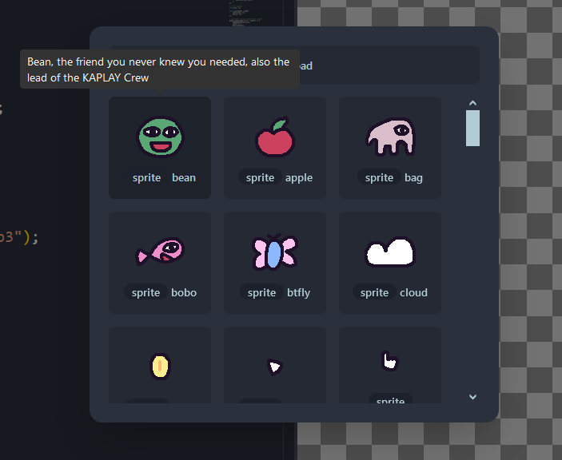

# State of KAPLAY #1

> lajbel, July 15, 2024

Hey everyone! It's been a while since our last update. A lot has been happening
in the world of KAPLAY/Kaboom.js, so let's dive into what's new.

## New Journey, from Kaboom.js to KAPLAY, Thanks Kaboom.js Community!

If you don't know, Kaboom.js was a game library for making games in the browser.
It was deprecated and now we have KAPLAY, a fork of Kaboom.js with new features,
fixes and community support.

We are working in `v3001`, why not **4000**? Because we want to add new features
and fix bugs without breaking the API. The idea is to have atleast a _99.99%_ of
games made with Kaboom.js **v3000** working in KAPLAY **v3001**.

We owe a huge debt of gratitude to the original Kaboom.js community, now the
thriving KAPLAY community. Special thanks go to:

- **tga**, original creator of Kaboom.js. Thanks for creating this amazing
  library.
- **MF**, for being a great contributor in Kaboom.js and also in KAPLAY, doing
  all the engineer work.
- **niceEli**, for being a great contributor in CI and also being active in the
  community.
- **AmySpark**, who contributed to the code and also is active in the community.
- **neverUsedDC**, for being a contributor in the code and also is active in the
  community.
- **SpcFork**, for being a contributor in the code and also is active in the
  community.
- **Haroon**, for being moderator of the Discord server and also is active in
  the community.
- **Shoozza**, for being a contributor in the code.
- **JSLegendDev**, for creating content about KAPLAY.
- **Gamedev.js**, for creating a [post](https://gamedevjs.com/tools/kaplay/)
  about KAPLAY.
- And all the other **contributors** and **community members**.

These individuals have been instrumental in transitioning from Kaboom.js to
KAPLAY and continuing to drive the library forward.

## New features

From the creation of KAPLAY, to today, the alpha number 17, the team and
contributors have been working hard to bring **new features and improvements**
to the library.

- **Input bindings**, use the same event `onButtonPress` for mouse, keyboard and
  gamepad.
- **Layers**, backing from the void.
- Navigation Mesh, waypoints, patrols, sentries, and more in the **pathfinding
  system**.
- **Particles system**, finally.
- Utils for colors, arrays, etc such as `Color.toArray()`, `shuffle()`, etc.
- Support for new shapes and drawing as textured polygons.
- Added support for **gravity directions** (inverting gravity??)
- and a lot more!

Check all current changes in the [CHANGELOG](/changelog).

In the code side, we had

- [Big Refactor PR](https://github.com/kaplayjs/kaplay/pull/258) of more than
  7000 line changes, that will make the codebase more organized and clean,
  improving our DX.
- [Strict TypeScript PR](https://github.com/kaplayjs/kaplay/pull/232), that
  passed all the codebase to Strict TypeScript, to avoid bugs and have a better
  development experience.

Thanks to all our contributors, we are growing and improving the library.

## New website and documentation

With the project migration, the website also changed. This version of the
website has the API documentation splitted in various pages, to load faster and
be more organized.

Also searchbars were added to the documentation and blog, so you can find
content faster.

## Asset Brew

We added the asset brew, a UI to get all KAPLAY Friends imported in your
[KAPLAYGROUND](https://play.kaplayjs.com) project.

(Secret: Hovering the asset will show you a description about it, know more
about the KAPLAY Lore)

## Collective funding

We are now in [Open Collective](https://opencollective.com/kaplay), a platform
where you can support the project with donations and sponsorships.

The funds will be used for paying the team, maintaining the project and for
prizes in game jams. Open Collective is fully transparent, you can see how the
funds are being used.

Thanks to all who have contributed to our Ko-Fi donation campaign, special
thanks to:

- AndrewWooldridge for donating $100 USD and also being a sponsor.
- Candy&Carmel for donating $5 USD and also being a recognized community member.
- Myte for donating $5 USD and also being a sponsor.
- Hi Fi Labs for being a sponsor.
- Also thanks to 2 anonymous donors.

All money in Ko-Fi is public, $149 USD, thanks to all of you! This money will be
exclusively used in a future Game Jam, stay tuned!

## Community Highlights

We love to empower the community, and we have a lot of things happening there.
There's games made with KAPLAY/Boom, tutorials, and more.

### Games

- [Nodemania](https://play.google.com/store/apps/details?id=pl.solutech.nodemania1):
  Relaxing puzzle games, released in Google Play. Made with Kaboom.js +
  Capacitor.

<iframe src="https://www.youtube.com/embed/m636OQnV-wY?si=d3TuX99_YZJAnWUS" title="YouTube video player" frameborder="0" allow="accelerometer; autoplay; clipboard-write; encrypted-media; gyroscope; picture-in-picture; web-share" referrerpolicy="strict-origin-when-cross-origin" allowfullscreen></iframe>

- [What The Floosh Game](https://igorwastaken.itch.io/wtfl-game): A puzzle game
  about avoiding obstacles and collecting coins. Made with KAPLAY

### Tutorials

- [JSLegendDev](https://www.youtube.com/@JSLegendDev) created a tutorial of
  KAPLAY + Tauri to do desktop games.

<iframe  src="https://www.youtube.com/embed/mbljv1EkrRQ?si=pocHEU0JBpPE8kFQ" title="YouTube video player" frameborder="0" allow="accelerometer; autoplay; clipboard-write; encrypted-media; gyroscope; picture-in-picture; web-share" referrerpolicy="strict-origin-when-cross-origin" allowfullscreen></iframe>

- [AutMouse Labs](https://www.youtube.com/@AutMouseLabs) started a series of
  live coding with KAPLAY, showing how to make a shooter game.

<iframe src="https://www.youtube.com/embed/rGV5Kd1zrcc?si=d2HaTWKtr61Qhv28" title="YouTube video player" frameborder="0" allow="accelerometer; autoplay; clipboard-write; encrypted-media; gyroscope; picture-in-picture; web-share" referrerpolicy="strict-origin-when-cross-origin" allowfullscreen></iframe>

- JSLegendDev made a post about
  [how to fix the horizontal movement in KAPLAY.](https://open.substack.com/pub/jslegenddev/p/how-to-fix-diagonal-movement-in-2d?utm_campaign=post&utm_medium=web)
- JSLegend made a post about
  [how to use Zelda style camera in KAPLAY](https://substack.com/home/post/p-146000454).
- JSLegend made a post about
  [KAPLAY's Camera System](https://substack.com/home/post/p-145935418)

### Misc

- JSLegendDev explained the change from Kaboom.js to KAPLAY in a video

<iframe src="https://www.youtube.com/embed/EBbcsu9OrgE?si=oLeArOXbx3huOEUH" title="YouTube video player" frameborder="0" allow="accelerometer; autoplay; clipboard-write; encrypted-media; gyroscope; picture-in-picture; web-share" referrerpolicy="strict-origin-when-cross-origin" allowfullscreen></iframe>

## Conclusion

That's all for this first edition of the State of KAPLAY. We are working hard to
bring new features and improvements to the library. If you want to help us, you
can contribute to the project, donate in Open Collective, or just share the
library with your friends.
