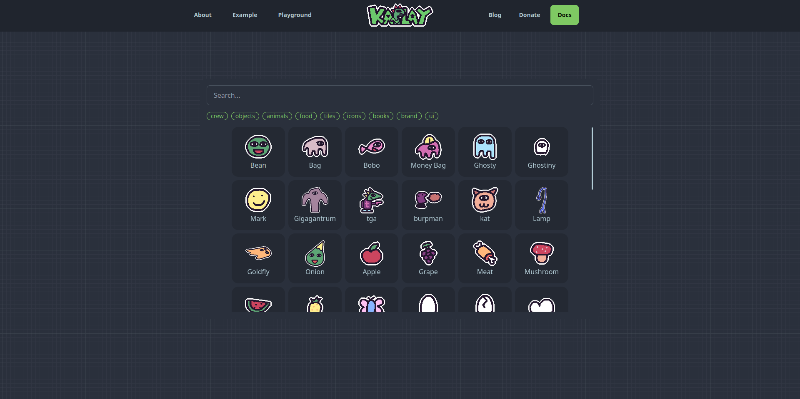

# State of KAPLAY #2

> lajbel, September 2, 2024

Hey! Welcome to State of KAPLAY in their second edition. Quite some time passed
between the previous state and this one. From now all States of KAPLAY will be
published on the 2nd of every month. Time to start with the news.

## When will the next version of KAPLAY be Released?

We are working on two versions currently, **v4000** will be the release with
most features, breaking changes and best improvements, while **v3001** is the
most compatible version with Kaboom.js and also previous tutorials will work
with this version.

## Releasing dates

We got some dates, but we can tell you that the beta of **v3001** will be out on
**September 7th**, the World Beard day. This is the first step to have our first
stable version, while **v4000** is getting the most awaited features.

## KAPLAY Crew: Our wiki

We released the KAPLAY Crew, which our portal of assets, characters and all
related to the KAWord (KAPLAY World). It works as an assets browser (if you want
to download them) and also as a wiki for our lore lovers.

## KAPLAY New features

There's a bunch of new KAPLAY Features, if not specified, all features work for
**v3001** and **v4000**

-   **New API** Fake cursor, to simulate behavior of a cursor in a game object
-   Color and Vec2 helpers helpers, `Color.toArray()`, `Vec2.toArray`,
    `Vec2.fromArray`
-   Choice the button in `onClick("left")`
-   `lifespan()` now requires `opacity()` explicitly
-   Many bugs in components fixed like `stay()`
-   `fixedDt`, `fixedUpdate` and in general a rework on physics frame handling
-   Fixes some shapes and drawing functions like text, eclipses, etc
-   Mouse delta positon
-   Optimized collisions to only happen when needed
-   Now error screen can be thrown from an input event
-   Much much bug fixes, literally a lot I can't put all them

## Community Highlights

From now, thanks to all our contributors! All the mentions are on our changelogs
in the repository. Now we will highlight some of the new games and videos made
by the community.

### Games

**Clickery Hexagon** by **AmySpark** is a simple game where you need to click a
hexagon. We published the trailer on our
[YouTube Channel](https://youtube.com/@kaplayjs).

<iframe src="https://www.youtube-nocookie.com/embed/fhVhcYxPrx0?si=ztdVmZGQwVYWZFFU" title="YouTube video player" frameborder="0" allow="accelerometer; autoplay; clipboard-write; encrypted-media; gyroscope; picture-in-picture; web-share" referrerpolicy="strict-origin-when-cross-origin" allowfullscreen class="yt"></iframe>

**Sonic Ring Run** by **JSLegendDev** is a Sonic-like game where you need to
collect rings and jump. It comes with a great tutorial

<iframe src="https://www.youtube-nocookie.com/embed/wfRvhPm5qFc?si=O0JpjftZj_4MVdIl" title="YouTube video player" frameborder="0" allow="accelerometer; autoplay; clipboard-write; encrypted-media; gyroscope; picture-in-picture; web-share" referrerpolicy="strict-origin-when-cross-origin" allowfullscreen class="yt"></iframe>

### Tutorials

In this tutorial, **JSLegendDev** present us a crash course on KAPLAY

<iframe src="https://www.youtube.com/embed/FdEYxGoy5_c?si=Q_BxSXscXDxNWKau" title="YouTube video player" frameborder="0" allow="accelerometer; autoplay; clipboard-write; encrypted-media; gyroscope; picture-in-picture; web-share" referrerpolicy="strict-origin-when-cross-origin" allowfullscreen class="yt"></iframe>

Also, if you don't know JavaScript, **JSLegendDev** also did a basic JavaScript
tutorial.

<iframe src="https://www.youtube-nocookie.com/embed/XZEcO3OWjdA?si=6vfqmvPy1lm8btce" title="YouTube video player" frameborder="0" allow="accelerometer; autoplay; clipboard-write; encrypted-media; gyroscope; picture-in-picture; web-share" referrerpolicy="strict-origin-when-cross-origin" allowfullscreen class="yt"></iframe>

## Message from developers

> Thanks to all the community for the support, we are working hard to improve
> KAPLAY

-- lajbel

> If anything breaks, please file an issue

-- MF
