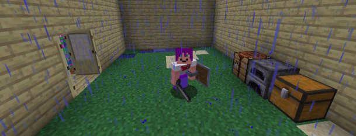

import { Image } from "astro:assets";
import flyersImage from "./assets/flyers.png"
import godotImage from "./assets/godottokaplay.png"
import kaplaygroundImage from "./assets/kaplaygrounddiffs.png"

> lajbel, October 2 of 2024, from Ghosty's house

Hey KAPLAYERS! How are you? Welcome to The State of KAPLAY #3, the blog where we
talk about KAPLAY. And yes, I'm doing my promise reality publishing this blog 2
of October.

## KAPLAY Updates, what devs are cooking? 🧑‍🍳

Okay, what are we cooking on KAPLAY? Our maths expert **MF** is working on much
performance improvements for **v4000**. Actually he has a branch where he
improved the velocity of game objects in general, at the point where our
_bench.js_ example with 5000 game objects with `[sprite(), pos()]` passed from
**25 to 60fps** on Chromium.

Also I'm working on optimizations on our Texture Packer, so you can remove
sprites from memory, to save resources on big games. Also, I'm redoing many
examples to be updated and also intuitive.

These PR will be very important and one more step for KAPLAY v4000.

Another things includes bug fixes, collisions adjustments and more stuff. We
released two versions, **v4000.0.0-alpha.5** and **v3001.0.0-beta.3**. Here's
the
[changelog](https://github.com/kaplayjs/kaplay/releases/tag/3001.0.0-beta.2).

From here, thanks to all our contributors, specially to *dragoncoder047*, 
*niceEli* and *imaginarny*. Thanks for your contributions!

## KAPLAY touching grass in an event

KAPLAY Recently went to the **FIJA** (_International Feria of Argentinian
Videogames_, me and my official team helper, _Jairo_, went to it. We presented
KAPLAY to many people, gifted stickers and also gave some pins. From here,
thanks to [Himu](https://himu.ar) for give us **his half of a stand** THANK YOU SO MUCH.

Here are some pictures of the **FIJA**:

<div class="flex flex-wrap gap-2 flex-col lg:flex-row">
<figure>
  <Image src={flyersImage} alt="Our stand" class="lg:max-w-sm"/>
  <figcaption>Our flyers</figcaption>
</figure>
<figure>
  <Image src={godotImage} alt="Godot user using KAPLAY" class="lg:max-w-sm"/>
  <figcaption>Godot user using KAPLAY</figcaption>
</figure>
</div>

Thanks to everyone who came, I haven't seen any community member but many people
interested on become a true KAPLAYER.

## KAPLAYGROUND v2, spoilers

The most thing I'm working is on KAPLAYGROUND v2, it comes with a lot of new
features

- Multi-file editing
- Two modes, project & examples, with classic KAPLAYGROUND experience
- Import assets, save them
- Project & Examples browsing
- Some cool editor integrations like see previews of `loadXXXX` funcs, or load
  assets from a Context Menu instead of write them manually.

I don't have a date for it atm, but probably coming this month. You can also try
[this preview version](https://new-editor.kaplay.pages.dev/)

<Image src={kaplaygroundImage} alt="KAPLAYGROUND v2" style="width: 70%;"/>


## KAPLAY entering to Minecraft

Yes, we got a **Minecraft Server** SMP, thanks to [niceEli](https://niceeli.tech/), he
setup a Minecraft server for us, where you can play with your friends, build
stuff and show your beans. Here's a picture of me



You can join us at:

```
mc.kaplayjs.com:58247 Java
mcbr.kaplayjs.com port 3248 Bedrock
```

## And from the Jurassic...

From the Jurassic we have to say bye bye, we will come with the next news on
KAPLAY soon. Maybe a release this month...? Yes, that, KAPLAY v3001 date will be
revealed this month, so stay alive!
