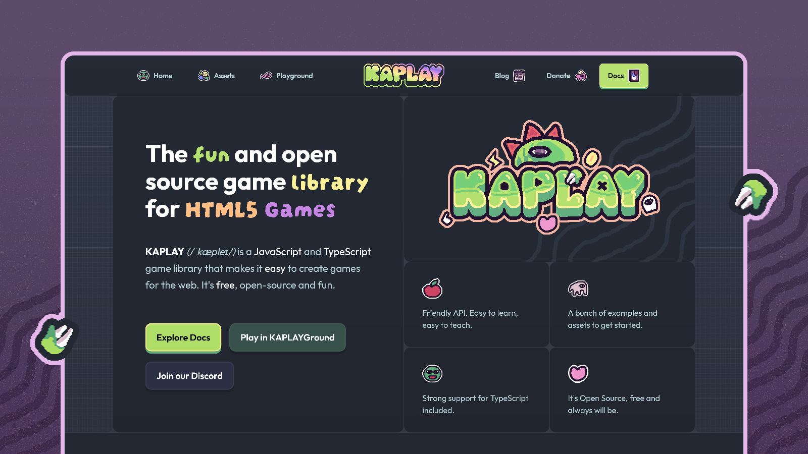
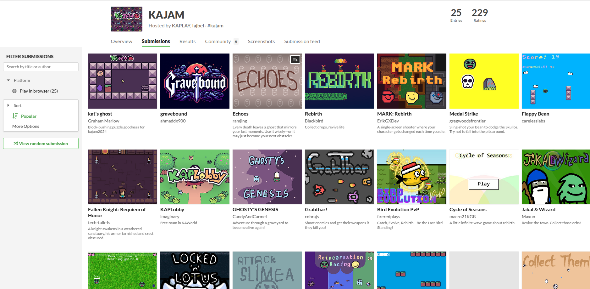
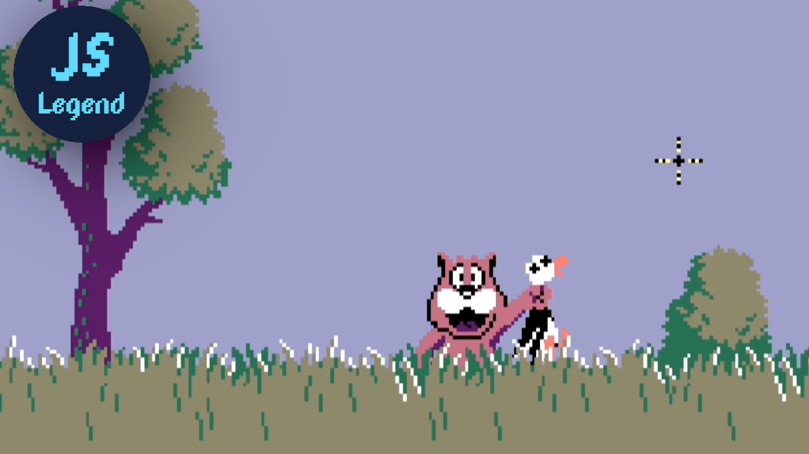

# State of KAPLAY #4

> {writer.userName}, 16th of February, 2025, from Bean's racing car

Hey everyone!

What a ride! Last year was filled with amazing things, rebranding, KAJAM,
partnerships, performance enhancements, new features and more. Now it’s time for
another impressive update on the current state of KAPLAY in 2025. A lot of
things have happened backstage and we’re thrilled to share these updates with
you. Before we dive in, did you notice something different while you were
reading…?

## **The Difference in Writer**

As a community manager of KAPLAY (In case you don’t know it’s Elaine from
Discord) I’m the new blogger of KAPLAY too. From now on, I'll mostly be writing
about ‘’State of KAPLAY’’. Maybe you saw the difference in the first paragraph.
We are planning on creating amazing things for KAPLAY. So stay tuned. 

## Brand New Look of KAPLAY

We’re excited to share some **huge updates** with you! As part of our commitment
to making KAPLAY the **best** game development framework for HTML5 games, we’re
rolling out a **major rebranding** that includes a **new logo, a redesigned
website with a fresh overall look**. Huge thanks to **Misanthrope** for his
incredible efforts to make this website real. He put a lot of time and effort in
it and created an incredible brand new logo and this website. Thanks a lot!

### Why the Rebrand?

KAPLAY has evolved a lot over time, and we felt that our branding should reflect
that growth. We wanted something that looks **professional and modern**, while
keeping KAPLAY’s playful identity

With that in mind, we’re bringing a **new visual identity** to KAPLAY’s Dino
that aligns with our mission—to make game development more **accessible, fun,
and powerful** for developers of all skill levels.

### **What’s Changing?**

#### **1. A Brand-New Logo**

Our new logo embraces **KAPLAY’s fun and colorful nature**, while giving it a
more **polished and professional touch**.

#### **2. A Redesigned Website**

Navigating KAPLAY is now **easier than ever**! We’ve reworked our website with:

-  A **modern and intuitive UI** for seamless browsing
- A fresh **color palette** and **smoother animations**
- Great and **interactive** examples in the home page

#### **3. Improved Documentation**

We know how important **clear and accessible** documentation is. That’s why
we’ve overhauled our docs to be:

- **Better organized** with a cleaner layout
- **Easier to read** with improved formatting
- **More interactive**, making it simpler to learn

## KAJAM: Where Ideas Become Real

This month, we hosted KAJAM, our very first game jam as KAPLAY! The theme was
Rebirth and the creativity from the community was incredible! Developers with
different minds and ideas came together to craft unique games using KAPLAY. A
special thanks to **Colyseus**, our sponsor, for their generous support. They
provided free usage of their platform for a week to all KAJAM participants,
enabling developers to explore multiplayer game ideas with ease. We’ll talk
about KAPLAY x Colyseus later in detail.

We finished the process of showcasing the winners and participants, so you can
[check out the winners](https://itch.io/jam/kajam/topic/4321892/kajam-winners).
A huge thanks to everyone who participated–you’re the heart of this community!
Until next KAJAM, keep creating. We can’t wait to see what brings to life the
next KAJAM!

## KAPLAY x Colyseus

We’re thrilled to announce a new partnership with **Colyseus**, the multiplayer
game framework in which you can own your authoritative game servers. As part of
this collaboration, we’re working on a comprehensive **KAPLAY + Colyseus guide**
to help you integrate multiplayer features seamlessly into your KAPLAY
projects. 

You can start looking around [the template](https://github.com/colyseus/kaplay)
that **Colyseus** made.

## What’s New in v3001.1

The upcoming v3001.1 update introduces some highly anticipated features:

- New Tag Management:

- `.tag` **and** `.untag`: Simplified methods to add or remove tags.

- **Collision-Free Tags and Components**: With
  `kaplay({ tagsAsComponents: false })`, you can now cleanly separate tags and
  components.

  - `.tag`, `.untag`, `.is`: For managing tags.

  - `.use`, `.unuse`, `.has`: For managing components.

This makes managing game entities more intuitive while resolving conflicts that
previously existed when tags and components shared the same name.

Besides this, there is other awesome features:

- Added `kaplay({ spriteAtlasPadding })` for setting the space between the
  sprites in the sprite atlas
- Added trigger(event, tag, ...args) for global triggering events on a specific
- Added { indentAll?: boolean } in TextCompOpt to indent every new line

And more is coming, like **css colors**, stay tuned in our
[releases page](https://github.com/kaplayjs/kaplay/releases).

## Reflecting on the v3001 Release

It’s been over a few months since we launched **v3001**, our first stable
release of KAPLAY. This milestone marked the beginning of a new chapter for the
library, and we couldn’t have done it without the incredible support of the
community.

With v3001 as a stable foundation, we’re now focused on evolving KAPLAY with the
development of v4000 while maintaining full support for v3001.

## Performance Enhancements and v4000

While we continue supporting v3001, **MF** has been hard at work improving
performance for the next major release: **v4000**. This upcoming version is
designed to prepare KAPLAY for big-scale games, ensuring it’s ready to handle
more complex and demanding projects.

Some of the things that are coming in v4000: 

- Replace core systems like collisions

- Restitution, Friction and physics improvements

- Support for circled areas

- Low-level optimizations, refactoring the core of KAPLAY

- Change parent in game objects

## Welcome KAPLAY Crew Members!

We’re delighted to introduce two new members to the KAPLAY crew. **Skuller**,
**Zombean** and **Karat**. Their expertise and enthusiasm are sure to bring
fresh energy to the KAWorld! Skuller is here to give you chills! With a knack
for trick-or-treating and scaring, she’s our very own spooky bones expert.

Meanwhile, Karat, the tiny rat from the rocks of KAWorld, is always up for an
adventure. When she's not digging through the dirt or exploring the unknown,
you’ll find her snacking on cheese, her true love.

And last but not least, Zombean! Don’t worry—he’s not here to snack on your
brains, just your beans! He’s all about collecting, chasing and of course,
eating beans, with a healthy obsession for everything green.

<video width="320" height="240" controls>
  <source src="/whereisthatchesse.mp4" type="video/mp4">
</video>

## Community Highlight: A Duck Hunt-like game course

Our friend JSLegend is releasing a new course using KAPLAY.js, there you will
learn all you need for creating a classic Duck-Hunt like game, perfect for
beginners! You can check the course in
[JSLegend's Patreon](https://www.patreon.com/collection/1310455?view=expanded)

## Thank You, KAPLAY Community!

As always, we’re deeply grateful for the support and enthusiasm of the KAPLAY
community. Whether you’re crafting tutorials, creating amazing games or just
spreading the word, you’re helping to make KAPLAY what it is today and this is
just the beginning! We’re working on even more features, improvements, and
community-driven updates. Your feedback is what drives KAPLAY forward, so we’d
love to hear your thoughts on this rebrand!

Special thanks to **amygaming**, **chqs-git**, **dragoncoder**, **JSLegend**,
**marianyp**, **niceEli**, and many others for their special contributions to
KAPLAY.

If you’d like to contribute to KAPLAY, check it out on
[Open Collective](https://kaplayjs.com), donate, or simply share KAPLAY with
your friends. Don’t forget to join us on **Discord** to connect with fellow
developers, ask questions, or showcase your projects.

**Try the new website, explore the updated docs, and enjoy the fresh KAPLAY
experience!**

Stay tuned for more updates, and as always—**keep creating awesome games!**
