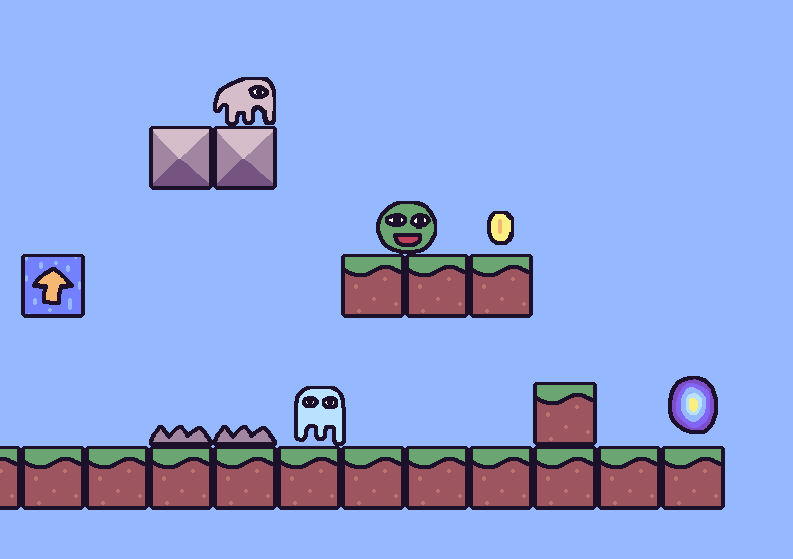
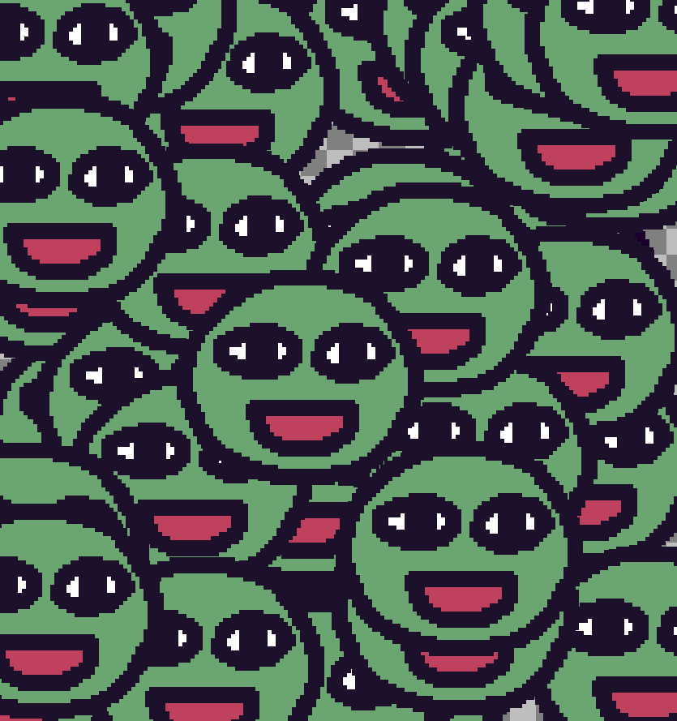
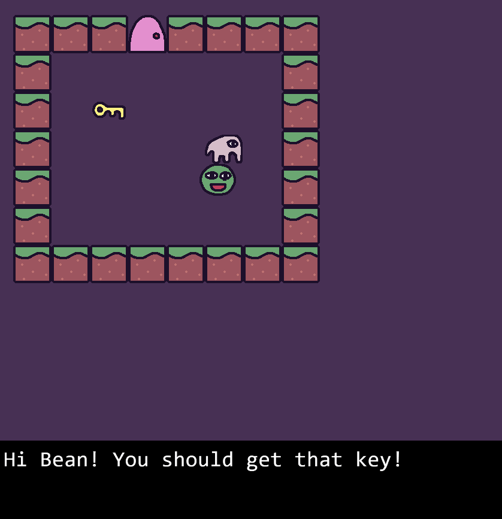
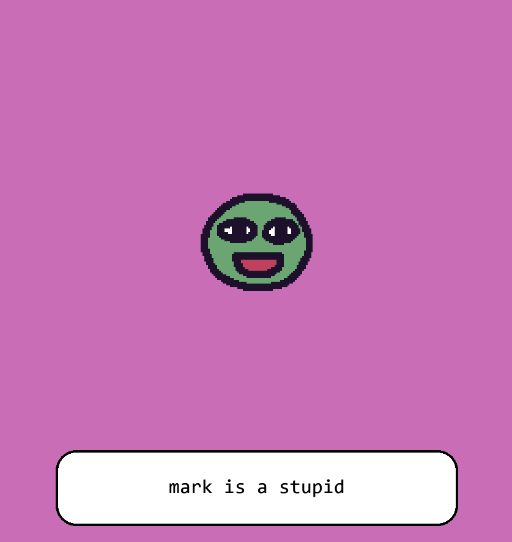

## About

**KAPLAY** (_/ˈkæpleɪ/_) is a **JavaScript** library that helps you make games **fast** and **fun**! With an
easy API and a focus on **games**, you can create games **quickly** without writing many lines of code.

**KAPLAYGROUND** is the official playground of KAPLAY, where you can test our examples and learn how to use KAPLAY.

We are also working on **KAPLAY** **Editor**, a games editor for KAPLAY, where you can create games in your browser.

## Features

- Creation of levels using ASCII maps.
- An ECS (Entity Component System) architecture.
- A powerful event system.
- Arcade physics, fast and simple.
- A bunch of examples to get you started quickly [here](https://play.kaplayjs.com).
- A large community of developers who creates plugins and share them with the community on our official Discord.
- Fully compatible with Kaboom.js 3000.

## The backstory

On _21 May 2024_ we took the decision to create this spiritual successor of
**Kaboom.js**, being also a fork of it.

This was due to Kaboom.js being abandoned by Replit, the original creator of
Kaboom.js, and the community was left without a maintainer.

The idea is to expand what kaboom was under a new identity, **KAPLAY** itself is
fully compatible with Kaboom.

## Logos, names and other assets

The name is **KAPLAY**, a play on the word "kaboom" and the word "play", it's
written in all caps, **KAPLAY**, not **KaPlay** or **Kaplay**. Anyway **kaplay** (lowercase) is also acceptable.

**KAPLAY logo (outlined, webp animation)**

**KAPLAY logo (webp animation)**

**KAPLAY logo (outlined, png)**

**KAPLAY logo (png)**

## Colors

<table>
  <tr>
    <td style="background-color: #6bc96c; color: #000000;">#ffd700</td>
    <td style="background-color: #5ba675; color: #000000;">#5ba675</td>
    <td style="background-color: #1f102a; color: #ffffff;">#1f102a</td>
    <td style="background-color: #cc425e; color: #ffffff;">#cc425e</td>
    <td style="background-color: #4a3052; color: #ffffff;">#4a3052</td>
    <td style="background-color: #ffffff; color: #000000;">#ffffff</td>
</tr>
</table>

## Screenshots

### Platformer

### Drag and Drop

### Shooter

### RPG

### Visual Novel

### KAPLAYGROUND

